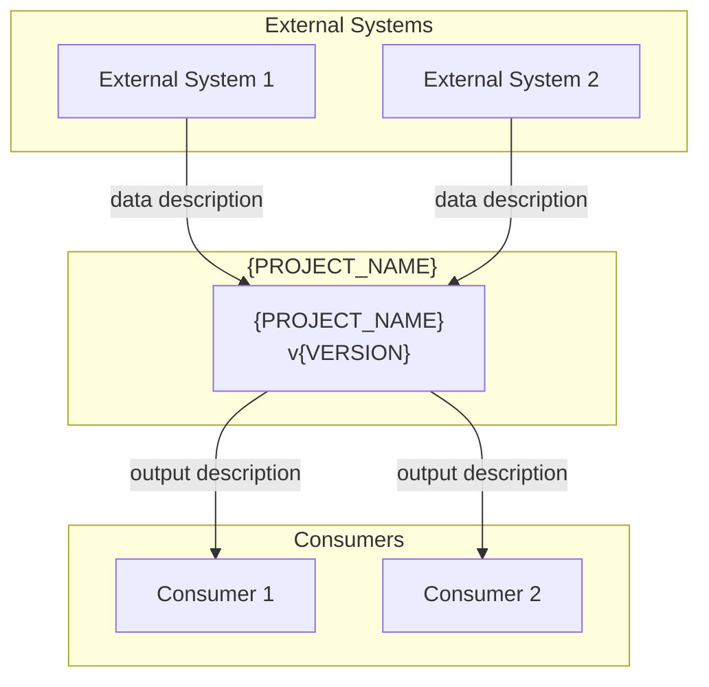
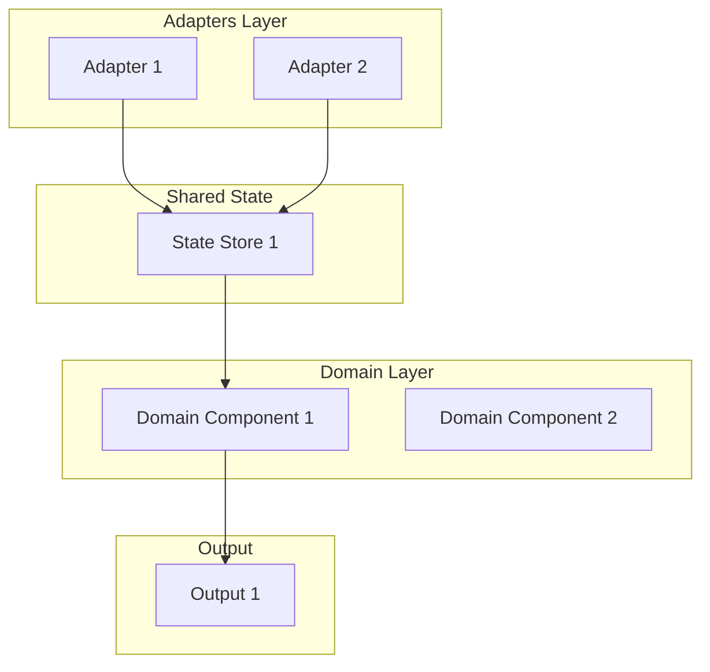
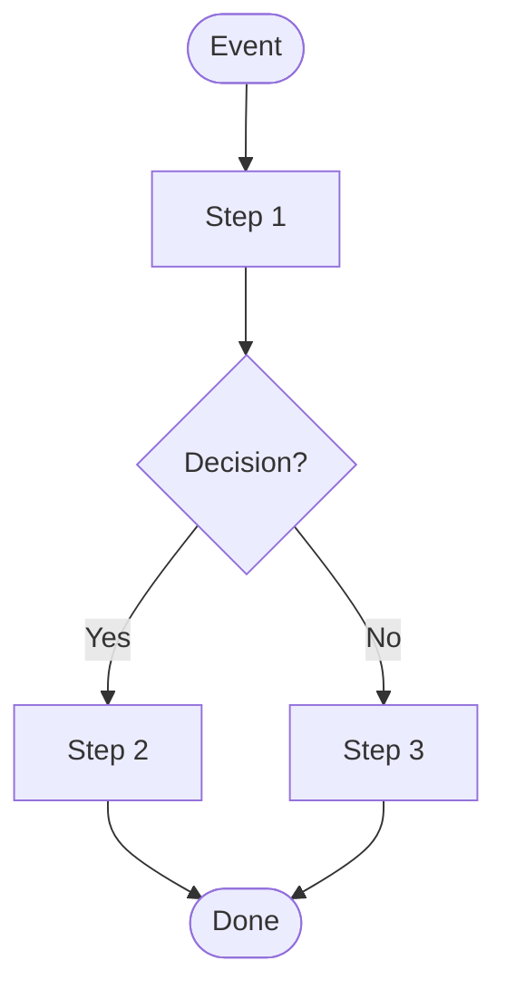
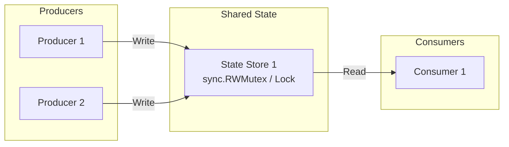

# {PROJECT_NAME} — Technical Architecture

<!--
╔══════════════════════════════════════════════════════════════════════════════╗
║                    CLAUDE CODE — ARCHITECTURE TEMPLATE                      ║
║                                                                              ║
║  PURPOSE: Generate a COMPLETE architecture document for a new project.       ║
║  MODEL: Use Opus for generating this document.                               ║
║  INPUT: Approved PROJECT-KICKOFF.md                                          ║
║  OUTPUT: A document so detailed that implementation is mechanical.           ║
║                                                                              ║
║  RULES:                                                                      ║
║  1. Fill in EVERY section. Leave NOTHING as placeholder.                     ║
║  2. Use Context7 to verify ALL API versions and patterns.                    ║
║  3. Include COMPLETE code for all interfaces, structs, and core functions.   ║
║  4. Every architectural decision must have alternatives and trade-offs.      ║
║  5. All diagrams must be Mermaid format.                                     ║
║  6. The development spec will reference section numbers from this doc.       ║
║  7. Do NOT proceed to sprint planning until human approves this document.    ║
║                                                                              ║
║  TECHNOLOGY-AGNOSTIC NOTES:                                                  ║
║  - Replace Go code examples with the project's language                      ║
║  - Adapt "controllers" terminology to match the project (handlers,           ║
║    services, endpoints, etc.)                                                ║
║  - Adjust testing framework references (go test, pytest, jest, etc.)         ║
║  - Adapt deployment sections to the target platform                          ║
║                                                                              ║
║  REFERENCE: Based on GPU Reporter ARCHITECTURE-1_0_0.md (4000+ lines)       ║
╚══════════════════════════════════════════════════════════════════════════════╝
-->

**Version**: {VERSION}
**Date**: {DATE}
**JIRA**: [{JIRA_ID}]({JIRA_URL})
**Author**: {TEAM_NAME}
**Methodology**: TDD (Test-Driven Development), Incremental Delivery
**Target coverage**: > {COVERAGE_TARGET}%

---

## Table of Contents

1. [Executive Summary](#1-executive-summary)
2. [System Context](#2-system-context)
3. [Architecture Overview](#3-architecture-overview)
4. [Detailed Components](#4-detailed-components)
5. [Data Structures](#5-data-structures)
6. [Business Logic Layer](#6-business-logic-layer)
7. [Adapter Layer](#7-adapter-layer)
8. [Shared State Management](#8-shared-state-management)
9. [Metrics and Observability](#9-metrics-and-observability)
10. [Security](#10-security)
11. [Deployment](#11-deployment)
12. [Configuration](#12-configuration)
13. [Error Handling and Resilience](#13-error-handling-and-resilience)
14. [Project Structure](#14-project-structure)
15. [Testing Strategy](#15-testing-strategy)
16. [External Dependencies](#16-external-dependencies)
17. [Performance Requirements](#17-performance-requirements)
18. [Operational Runbooks](#18-operational-runbooks)
19. [Dashboard Specification](#19-dashboard-specification)
20. [API and Interface Contracts](#20-api-and-interface-contracts)
21. [Metrics Reference](#21-metrics-reference)

---

## 1. Executive Summary

### 1.1 Purpose

<!--
CLAUDE: Write 2-3 paragraphs explaining:
- What the system does (business value)
- Why it's needed (problem it solves)
- How it works at the highest level (one sentence)
-->

### 1.2 Key Characteristics

<!--
CLAUDE: List 5-8 bullet points of the system's defining characteristics.
Example:
- **Read-only**: Never modifies watched resources
- **Event-driven**: Reacts to changes in real-time via watches/webhooks
- **Stateless**: Rebuilds state from source on restart
-->

### 1.3 Scope

**In Scope**:
<!-- List features included in this version -->

**Out of Scope**:
<!-- List features explicitly excluded -->

---

## 2. System Context

### 2.1 Context Diagram

<!--
CLAUDE: Create a Mermaid diagram showing:
- The system as a central box
- All external systems it interacts with
- Direction of data flow (arrows)
- Labels on connections explaining what data flows
-->



### 2.2 Actors and Interfaces

| Actor | Type | Interface | Data Flow |
|-------|------|-----------|-----------|
| {ACTOR_1} | [System/Human/External] | [API/Watch/Event] | [IN/OUT/BOTH] |

---

## 3. Architecture Overview

### 3.1 High-Level Architecture

<!--
CLAUDE: Create a detailed Mermaid diagram showing:
- All internal components (grouped by layer)
- Data flow between components
- External interfaces
- Shared state stores
Use subgraph groupings for layers (Domain, Adapters, Infrastructure)
-->



### 3.2 Architecture Decisions

<!--
CLAUDE: Document ALL architecture decisions using this format.
Include AT LEAST 4-6 decisions. Common decisions:
- Technology choice (language, framework)
- Architecture pattern (hexagonal, MVC, etc.)
- Data storage strategy (in-memory, database, etc.)
- Communication pattern (REST, gRPC, events, watches)
- Scope (namespaced vs cluster-wide, single vs multi-region)
- External dependency management (import vs local types)
-->

#### AD-1: {DECISION_TITLE}

**Decision**: {WHAT WAS DECIDED}

**Alternatives considered**:
- {ALTERNATIVE_1}
- {ALTERNATIVE_2}

**Reasons**:
1. **{REASON_CATEGORY}**: {EXPLANATION}
2. **{REASON_CATEGORY}**: {EXPLANATION}
3. **{REASON_CATEGORY}**: {EXPLANATION}

**Trade-offs**:
- ✅ {ADVANTAGE_1}
- ✅ {ADVANTAGE_2}
- ❌ {DISADVANTAGE_1}
- ❌ {DISADVANTAGE_2}

#### AD-2: {DECISION_TITLE}

<!-- CLAUDE: Repeat the AD format for each decision -->

---

## 4. Detailed Components

<!--
CLAUDE: For EACH component in the system, provide:
- Responsibilities (numbered list)
- Interface/Contract (full code)
- Implementation (full code with comments)
- Flow diagram (if complex)
- Predicates/Filters (if applicable)
- Error handling behavior
-->

### 4.1 {COMPONENT_1_NAME}

#### Responsibilities
1. {RESPONSIBILITY_1}
2. {RESPONSIBILITY_2}

#### Interface

```{LANGUAGE}
// {FILE_PATH}
{INTERFACE_CODE}
```

#### Implementation

```{LANGUAGE}
// {FILE_PATH}
{IMPLEMENTATION_CODE_WITH_COMMENTS}
```

#### Flow Diagram



#### Event Filtering / Predicates

```{LANGUAGE}
// {FILE_PATH}
// Only process events that match specific criteria
{PREDICATE_CODE}
```

### 4.2 {COMPONENT_2_NAME}

<!-- CLAUDE: Repeat for each component -->

---

## 5. Data Structures

<!--
CLAUDE: Document ALL data structures with:
- Complete struct/class definition with all fields
- Field-level documentation (type, source, description)
- Methods/functions on each structure
- Thread-safety annotations (if applicable)
- Serialization notes (JSON tags, etc.)
-->

### 5.1 {DATA_STRUCTURE_1}

```{LANGUAGE}
// {FILE_PATH}
{STRUCT_DEFINITION_WITH_COMMENTS}
```

| Field | Type | Source | Description |
|-------|------|--------|-------------|
| {FIELD} | {TYPE} | {SOURCE} | {DESCRIPTION} |

#### Methods

```{LANGUAGE}
{METHOD_SIGNATURES_AND_IMPLEMENTATIONS}
```

### 5.2 {DATA_STRUCTURE_2}

<!-- CLAUDE: Repeat for each data structure -->

---

## 6. Business Logic Layer

<!--
CLAUDE: Document the pure business logic (no framework dependencies).
This is the DOMAIN layer in hexagonal architecture.
Include:
- All algorithms with pseudo-code AND real code
- All business rules with examples
- Edge cases and how they're handled
- Input/output for each function
-->

### 6.1 {BUSINESS_FUNCTION_1}

#### Algorithm

```
1. {STEP_1}
2. {STEP_2}
   a. {SUB_STEP}
   b. {SUB_STEP}
3. {STEP_3}
```

#### Implementation

```{LANGUAGE}
// {FILE_PATH}
{FUNCTION_IMPLEMENTATION}
```

#### Edge Cases

| Case | Input | Expected Output | Handling |
|------|-------|----------------|----------|
| {CASE} | {INPUT} | {OUTPUT} | {HOW} |

### 6.2 {BUSINESS_FUNCTION_2}

<!-- CLAUDE: Repeat for each business function -->

---

## 7. Adapter Layer

<!--
CLAUDE: Document the framework-specific adapters.
These connect domain logic to external systems.
Include:
- Full code for each adapter
- How it maps external events to domain operations
- Error handling and retry logic
- Setup/registration code
-->

### 7.1 {ADAPTER_1_NAME}

#### Purpose
<!-- 1-2 sentences -->

#### Implementation

```{LANGUAGE}
// {FILE_PATH}
{ADAPTER_CODE}
```

#### Setup/Registration

```{LANGUAGE}
// {SETUP_FILE_PATH}
{SETUP_CODE}
```

---

## 8. Shared State Management

<!--
CLAUDE: Document all shared state:
- Thread-safety mechanisms (mutexes, channels, atomic)
- Concurrency patterns
- State rebuild on restart
- Cache invalidation strategy
-->

### 8.1 State Overview



### 8.2 {STATE_STORE_1}

#### Thread Safety

```{LANGUAGE}
{THREAD_SAFE_IMPLEMENTATION}
```

#### State Rebuild on Restart

<!-- How does the system recover state after a restart? -->

---

## 9. Metrics and Observability

### 9.1 Metrics Design

<!--
CLAUDE: Document EVERY metric with:
- Metric name (with prefix)
- Type (gauge, counter, histogram, summary)
- Labels (all label keys)
- Description
- When it's updated
- Example values
-->

#### Business Metrics

| # | Metric Name | Type | Labels | Description |
|---|------------|------|--------|-------------|
| 1 | `{PREFIX}_{NAME}` | gauge | `{label1}, {label2}` | {DESCRIPTION} |

#### Operational Metrics

| # | Metric Name | Type | Labels | Description |
|---|------------|------|--------|-------------|
| 1 | `{PREFIX}_{NAME}` | counter | `{label1}` | {DESCRIPTION} |

### 9.2 Metrics Implementation

```{LANGUAGE}
// {FILE_PATH}
{METRICS_REGISTRATION_CODE}
```

### 9.3 Health Endpoints

| Endpoint | Port | Purpose | Implementation |
|----------|------|---------|----------------|
| /healthz | {PORT} | Liveness | {DETAIL} |
| /readyz | {PORT} | Readiness | {DETAIL} |
| /metrics | {PORT} | Metrics | {DETAIL} |

---

## 10. Security

### 10.1 Container Security

```yaml
# Security context for all containers
securityContext:
  runAsNonRoot: true
  runAsUser: {UID}
  readOnlyRootFilesystem: true
  allowPrivilegeEscalation: false
  capabilities:
    drop: [ALL]
  seccompProfile:
    type: RuntimeDefault
```

### 10.2 RBAC

<!--
CLAUDE: Document EXACT RBAC rules needed.
-->

```yaml
# {FILE_PATH}
rules:
- apiGroups: ["{GROUP}"]
  resources: ["{RESOURCE}"]
  verbs: ["{VERBS}"]
```

### 10.3 Network Policies

```yaml
# {FILE_PATH}
{NETWORK_POLICY_YAML}
```

---

## 11. Deployment

### 11.1 Build

<!--
CLAUDE: Document the build process:
- Dockerfile (multi-stage if applicable)
- Build arguments
- Output artifact size
-->

```dockerfile
# Dockerfile
{DOCKERFILE_CONTENT}
```

### 11.2 Environment Configurations

| Environment | Replicas | Resources | Logging | Special |
|-------------|----------|-----------|---------|---------|
| Development | {N} | {CPU/MEM} | debug | {CONFIG} |
| Staging | {N} | {CPU/MEM} | info | {CONFIG} |
| Production | {N} | {CPU/MEM} | info | {CONFIG} |

### 11.3 Kustomize / Helm / Deployment Manifests

<!--
CLAUDE: Document the deployment structure.
Include base + overlay pattern if using Kustomize.
Include values.yaml structure if using Helm.
-->

```
config/
├── default/              # Base configuration
├── manager/              # Application deployment
├── rbac/                 # RBAC rules
├── {ADDITIONAL}/
└── overlays/
    ├── development/
    ├── staging/
    └── production/
```

---

## 12. Configuration

### 12.1 Command-Line Arguments

| Argument | Default | Description |
|----------|---------|-------------|
| `--{ARG}` | {DEFAULT} | {DESCRIPTION} |

### 12.2 Environment Variables

| Variable | Default | Description |
|----------|---------|-------------|
| `{VAR}` | {DEFAULT} | {DESCRIPTION} |

---

## 13. Error Handling and Resilience

### 13.1 Error Categories

| Category | Handling | Example |
|----------|----------|---------|
| Transient | Retry with backoff | Network timeout |
| Permanent | Log and skip | Invalid resource format |
| Fatal | Crash and restart | Cannot connect to API server |

### 13.2 Retry Strategy

```{LANGUAGE}
// Error handling pattern
{ERROR_HANDLING_CODE}
```

### 13.3 Graceful Shutdown

<!-- How does the system handle SIGTERM? -->

---

## 14. Project Structure

<!--
CLAUDE: Document the EXACT file structure.
Show which files belong to domain vs adapter layer.
Mark the entry point clearly.
-->

```
{PROJECT_NAME}/
├── {ENTRY_POINT}              # Application entry point
├── {DOMAIN_DIR}/              # Domain layer (pure business logic, no framework deps)
│   ├── {MODULE_1}/
│   │   ├── {FILE}.{EXT}
│   │   └── {FILE}_test.{EXT}
│   └── {MODULE_2}/
├── {ADAPTER_DIR}/             # Adapter layer (framework-specific)
│   ├── {ADAPTER_1}.{EXT}
│   └── {ADAPTER_1}_test.{EXT}
├── {CONFIG_DIR}/              # Deployment configuration
├── {TEST_DIR}/                # Integration/E2E tests
├── Dockerfile
├── Makefile / package.json / pyproject.toml
└── docs/
    ├── ARCHITECTURE-{VERSION}.md
    ├── DEVELOPMENT-SPEC-{VERSION}.md
    └── BUSINESS-LOGIC.md
```

**Important Notes**:
<!-- Any non-obvious structural decisions, e.g., entry point location -->

---

## 15. Testing Strategy

### 15.1 Test Levels

| Level | Framework | Target | Scope |
|-------|-----------|--------|-------|
| Unit | {FRAMEWORK} | > {COVERAGE}% | Domain logic in isolation |
| Unit (adapters) | {FRAMEWORK} | > {COVERAGE}% | Adapter logic with fakes |
| Integration | {FRAMEWORK} | Key flows | Cross-component with real deps |
| E2E | {FRAMEWORK} | Critical paths | Full system on target platform |

### 15.2 Test Infrastructure

<!--
CLAUDE: Document what test infrastructure is needed.
E.g., envtest for Kubernetes, testcontainers for databases, etc.
-->

### 15.3 Test Conventions

```{LANGUAGE}
// Example test structure
{TEST_EXAMPLE}
```

---

## 16. External Dependencies

<!--
CLAUDE: For EACH external dependency, document:
- Why it's needed
- How it's consumed (import, API call, copy)
- Version compatibility
- Fallback if unavailable
-->

### 16.1 {DEPENDENCY_1}

**Why**: {REASON}
**How consumed**: {METHOD}
**Version**: {VERSION}
**Fallback**: {FALLBACK}

---

## 17. Performance Requirements

| Requirement | Target | Measurement |
|------------|--------|-------------|
| {METRIC} | {TARGET} | {HOW_TO_MEASURE} |

---

## 18. Operational Runbooks

### 18.1 {SCENARIO_1}: {TITLE}

**Symptoms**: {SYMPTOMS}
**Investigation**:
```bash
{DIAGNOSTIC_COMMANDS}
```
**Resolution**: {RESOLUTION_STEPS}

---

## 19. Dashboard Specification

### 19.1 Dashboard Overview

| Category | Panels | Description |
|----------|--------|-------------|
| {CATEGORY_1} | {N} | {DESCRIPTION} |

### 19.2 Panel Specifications

<!--
CLAUDE: For each panel, document:
- Title
- Type (stat, gauge, table, graph, heatmap)
- Query/Formula
- Thresholds (if applicable)
-->

#### Panel: {PANEL_TITLE}

| Property | Value |
|----------|-------|
| Type | {TYPE} |
| Query | `{QUERY}` |
| Unit | {UNIT} |
| Thresholds | {THRESHOLDS} |

---

## 20. API and Interface Contracts

<!--
CLAUDE: Document ALL interfaces/contracts that components use to communicate.
These are the "ports" in hexagonal architecture.
Include complete code with method signatures, parameter types, and return types.
-->

### 20.1 {INTERFACE_1}

```{LANGUAGE}
// {FILE_PATH}
{INTERFACE_DEFINITION}
```

**Implementations**:
- `{IMPL_1}`: {PURPOSE}
- `{IMPL_2}`: {PURPOSE} (test double)

---

## 21. Metrics Reference

<!--
CLAUDE: Complete reference table of ALL metrics.
This section is referenced by the development spec (Sprint N for metrics implementation).
-->

**All metrics use the `{PREFIX}_` prefix.**

### Business Metrics ({N})

| # | Metric | Type | Labels | Description | Updated By |
|---|--------|------|--------|-------------|-----------|
| 1 | `{PREFIX}_{NAME}` | {TYPE} | `{LABELS}` | {DESC} | {COMPONENT} |

### Operational Metrics ({N})

| # | Metric | Type | Labels | Description | Updated By |
|---|--------|------|--------|-------------|-----------|
| 1 | `{PREFIX}_{NAME}` | {TYPE} | `{LABELS}` | {DESC} | {COMPONENT} |

**Total**: {TOTAL_N} metrics

---

**End of Architecture Document v{VERSION}**

<!--
╔══════════════════════════════════════════════════════════════════════════════╗
║  CLAUDE POST-GENERATION CHECKLIST:                                          ║
║                                                                              ║
║  Before presenting to human for approval:                                    ║
║  [ ] Every section is filled in (no placeholders remain)                     ║
║  [ ] All code compiles/is syntactically correct for the chosen language      ║
║  [ ] All Mermaid diagrams are valid and render correctly                     ║
║  [ ] All architecture decisions have alternatives and trade-offs             ║
║  [ ] Context7 was used to verify API versions and patterns                   ║
║  [ ] Metrics reference table is complete with all metrics                    ║
║  [ ] Security section covers container, RBAC, and network                    ║
║  [ ] Testing strategy matches coverage targets from PROJECT-KICKOFF         ║
║  [ ] External dependencies are fully documented                              ║
║  [ ] Project structure shows clear domain/adapter separation                 ║
║  [ ] Error handling covers transient, permanent, and fatal categories       ║
║  [ ] Dashboard spec matches observability requirements                       ║
║  [ ] All interfaces have complete code with types                            ║
╚══════════════════════════════════════════════════════════════════════════════╝
-->
