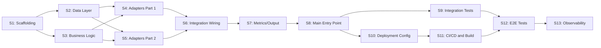

# {PROJECT_NAME} — Development Specification v{VERSION}

<!--
╔══════════════════════════════════════════════════════════════════════════════╗
║               CLAUDE CODE — DEVELOPMENT SPEC TEMPLATE                        ║
║                                                                              ║
║  PURPOSE: Generate a COMPLETE sprint-by-sprint development plan with         ║
║           TDD test code, component tracking, and traceability.               ║
║  MODEL: Use Opus for generating this document.                               ║
║  INPUT: Approved ARCHITECTURE-{VERSION}.md document.                         ║
║  OUTPUT: A development spec so detailed that implementation is mechanical.   ║
║                                                                              ║
║  RULES:                                                                      ║
║  1. EVERY sprint must have test code written FIRST (RED phase).              ║
║  2. Test code must be REAL, compilable code — not pseudocode.                ║
║  3. Each component gets a unique ID (C01, C02, ...).                         ║
║  4. Each sprint has explicit acceptance criteria with runnable commands.      ║
║  5. The completeness map tracks EVERY component.                             ║
║  6. Traceability matrix connects Requirements → Components → Tests.          ║
║  7. Use Context7 to verify test framework APIs and assertions.               ║
║                                                                              ║
║  SPRINT SIZING:                                                              ║
║  - 5-12 components per sprint (aim for ~8)                                   ║
║  - Each sprint produces a testable increment                                 ║
║  - Dependencies flow forward (S1 → S2 → S3)                                 ║
║  - If a sprint has >15 components, split it                                  ║
║                                                                              ║
║  REFERENCE: Based on DEVELOPMENT-SPEC-1_0_0.md (3900+ lines, 13 sprints)    ║
╚══════════════════════════════════════════════════════════════════════════════╝
-->

**Version**: {VERSION}
**Date**: {DATE}
**Based on**: [ARCHITECTURE-{VERSION}.md](ARCHITECTURE-{VERSION}.md)
**JIRA**: [{JIRA_ID}]({JIRA_URL})
**Methodology**: TDD (Red-Green-Refactor), Iterative-Incremental
**Target coverage**: > {COVERAGE_TARGET}%

---

## 1. Development Principles

### 1.1 TDD Methodology

All code follows **RED → GREEN → REFACTOR**:

1. **RED**: Write failing tests that define the expected behavior
   - Tests are written BEFORE implementation code
   - Tests must fail for the right reason (not compilation errors where avoidable)
   - Test code is specified in this document with exact assertions

2. **GREEN**: Write the minimum code to make all tests pass
   - No gold-plating — only what's needed to pass the tests
   - No optimization in this phase

3. **REFACTOR**: Improve code quality while keeping tests green
   - Extract constants, remove duplication
   - Improve naming and documentation
   - Run full test suite after every refactor

### 1.2 Iterative-Incremental Development

Each sprint produces a **verifiable increment**:
- New tests pass
- All previous tests pass (regression protection)
- Coverage targets are met
- The increment can be demonstrated or measured

### 1.3 Dependencies Between Sprints



<!--
CLAUDE: Adjust the dependency graph to match YOUR project's actual sprint decomposition.
The above is an example based on the GPU Reporter. Your project may have different sprints.
-->

### 1.4 Version Requirements (mandatory)

<!--
CLAUDE: List all version-pinned dependencies.
Verify versions using Context7 before writing.
-->

| Dependency | Minimum Version | Verified Via |
|-----------|----------------|-------------|
| {LANGUAGE} | {VERSION} | Context7 |
| {FRAMEWORK} | {VERSION} | Context7 |
| {TEST_FRAMEWORK} | {VERSION} | Context7 |

### 1.5 MCP Context7 (mandatory)

The use of **MCP Context7** is **mandatory** throughout development to ensure:
- Use of current and non-deprecated APIs
- Compatibility with target platform versions
- Correct import paths and module names
- Up-to-date testing patterns and assertions

### 1.6 Conventions

| Convention | Rule |
|-----------|------|
| Language | All code, comments, and docs in English |
| Test files | `{name}_test.{ext}` co-located with source |
| Test functions | `Test{Component}_{Scenario}` |
| Constants | `SCREAMING_SNAKE_CASE` or language convention |
| File naming | `snake_case.{ext}` or language convention |

---

## 2. Completeness Map

<!--
CLAUDE: Create a row for EVERY component in the project.
Components are numbered sequentially: C01, C02, ...
Group by sprint. Include ALL files and test files.
Status starts as "Pending" and changes to "✅ Done" during implementation.
-->

| # | Component | ARCH Section | Sprint | Files | Tests | Status |
|---|-----------|-------------|--------|-------|-------|--------|
| C01 | {COMPONENT_NAME} | {SECTION} | S1 | {FILE} | {TEST_FILE} | Pending |
| C02 | {COMPONENT_NAME} | {SECTION} | S1 | {FILE} | {TEST_FILE} | Pending |
| C03 | {COMPONENT_NAME} | {SECTION} | S2 | {FILE} | {TEST_FILE} | Pending |
<!-- ... continue for ALL components ... -->

**Total**: {N} components

---

## 3. Sprint Plan

### General Overview

| Sprint | Name | Components | New Tests | Verifiable Increment |
|--------|------|-----------|-----------|---------------------|
| S1 | {NAME} | C01-C{N} | {DESCRIPTION} | {WHAT_CAN_BE_VERIFIED} |
| S2 | {NAME} | C{N+1}-C{M} | ~{N} unit tests | {WHAT_CAN_BE_VERIFIED} |
<!-- ... continue for ALL sprints ... -->

---

<!--
╔══════════════════════════════════════════════════════════════════════════════╗
║  SPRINT SECTIONS: Repeat the following structure for EACH sprint.            ║
║                                                                              ║
║  Each sprint section MUST contain:                                           ║
║  1. Objective (1-3 sentences)                                                ║
║  2. Architecture Reference (section numbers from ARCHITECTURE doc)           ║
║  3. Component Table (ID, name, description, file, test file)                 ║
║  4. TDD Sections (Tests FIRST with real code, then implementation guidance)  ║
║  5. Acceptance Criteria (checkboxes with runnable commands)                   ║
╚══════════════════════════════════════════════════════════════════════════════╝
-->

## 4. Sprint 1: {SPRINT_NAME}

### Objective

<!--
CLAUDE: 1-3 sentences describing what this sprint achieves.
Focus on the business/technical value delivered.
-->

### Architecture Ref.

- ARCHITECTURE-{VERSION}.md Section {N} ({SECTION_NAME})
- ARCHITECTURE-{VERSION}.md Section {M} ({SECTION_NAME})

### Components: C01-C{N}

| # | Component | Description | File | Tests |
|---|-----------|-------------|------|-------|
| C01 | {NAME} | {DESCRIPTION} | {FILE} | {TEST_FILE} |
| C02 | {NAME} | {DESCRIPTION} | {FILE} | {TEST_FILE} |

### Tests FIRST (TDD)

#### T1.1: Tests for {COMPONENT/FEATURE}

**File:** `{TEST_FILE_PATH}`

```{LANGUAGE}
// {TEST_FILE_PATH}
{COMPLETE_TEST_CODE}

// Example for Go:
func Test{Component}_{Scenario}(t *testing.T) {
    tests := []struct {
        name     string
        input    {TYPE}
        expected {TYPE}
    }{
        {"description 1", input1, expected1},
        {"description 2", input2, expected2},
        // ... all test cases
    }

    for _, tt := range tests {
        t.Run(tt.name, func(t *testing.T) {
            result := {FUNCTION}(tt.input)
            assert.Equal(t, tt.expected, result)
        })
    }
}

// Example for Python:
// def test_{component}_{scenario}():
//     # Arrange
//     input = {VALUE}
//     # Act
//     result = {function}(input)
//     # Assert
//     assert result == {EXPECTED}

// Example for TypeScript:
// describe('{Component}', () => {
//     it('should {behavior}', () => {
//         const result = {function}({input});
//         expect(result).toEqual({expected});
//     });
// });
```

**Verification:** Tests fail (RED) — `{COMPONENT}` not yet implemented

#### T1.2: Tests for {COMPONENT/FEATURE_2}

**File:** `{TEST_FILE_PATH}`

```{LANGUAGE}
{COMPLETE_TEST_CODE_FOR_COMPONENT_2}
```

**Verification:** Tests fail (RED)

#### T1.3: Implement {COMPONENT/FEATURE}

**File:** `{SOURCE_FILE_PATH}`

<!--
CLAUDE: Describe the implementation approach.
Include import statements if they're non-obvious.
Reference the architecture document section for full code.
-->

Implement:
- `{STRUCT/CLASS/FUNCTION_1}`: {BRIEF_DESCRIPTION}
- `{STRUCT/CLASS/FUNCTION_2}`: {BRIEF_DESCRIPTION}

**Verification:** All tests pass (GREEN)

#### T1.4: Implement {COMPONENT/FEATURE_2}

**File:** `{SOURCE_FILE_PATH}`

Implement:
- {DESCRIPTION_OF_WHAT_TO_IMPLEMENT}

**Verification:** All tests pass (GREEN)

### Sprint 1 Acceptance Criteria

- [ ] `{TEST_COMMAND_1}` — all pass
- [ ] `{TEST_COMMAND_2}` — all pass
- [ ] {SPECIFIC_VERIFICATION_1}
- [ ] {SPECIFIC_VERIFICATION_2}
- [ ] Coverage > {TARGET}% for {PACKAGE}
- [ ] All existing tests still pass (regression)

---

## 5. Sprint 2: {SPRINT_NAME}

### Objective

### Architecture Ref.

### Components: C{N+1}-C{M}

| # | Component | Description | File | Tests |
|---|-----------|-------------|------|-------|

### Tests FIRST (TDD)

#### T2.1: Tests for {COMPONENT}

**File:** `{TEST_FILE_PATH}`

```{LANGUAGE}
{TEST_CODE}
```

**Verification:** Tests fail (RED)

#### T2.2: Tests for {COMPONENT}

```{LANGUAGE}
{TEST_CODE}
```

**Verification:** Tests fail (RED)

#### T2.3: Implement {COMPONENTS}

**Verification:** All tests pass (GREEN)

#### T2.4: Thread-Safety / Concurrency Tests

<!--
CLAUDE: If the component has shared state, include concurrency tests.
-->

```{LANGUAGE}
func Test{Component}_ConcurrentAccess(t *testing.T) {
    {CONCURRENT_TEST_CODE}
}
```

### Sprint 2 Acceptance Criteria

- [ ] {CRITERIA}
- [ ] All existing tests still pass (regression)

---

<!--
CLAUDE: Continue with Sprint 3, 4, 5, etc.
Each sprint follows the IDENTICAL structure:
  1. Objective
  2. Architecture Ref.
  3. Component Table
  4. TDD Sections (Tests FIRST)
  5. Acceptance Criteria

SPRINT TYPES (adjust content for each):

SCAFFOLDING SPRINT:
- Project initialization
- Type definitions, API types
- Verification: `{BUILD_COMMAND}` compiles

DATA LAYER SPRINT:
- Cache/store implementations
- Thread-safe data structures
- Verification: Unit tests + race detection

BUSINESS LOGIC SPRINT:
- Pure domain functions
- Algorithm implementations
- Verification: Extensive table-driven tests

ADAPTER SPRINT:
- Controllers, handlers, services
- Framework-specific code
- Verification: Tests with fake/mock dependencies

METRICS SPRINT:
- Metric registration
- Metric emission logic
- Verification: Metric value assertions

INTEGRATION SPRINT:
- Cross-component tests
- Real dependencies (envtest, testcontainers)
- Verification: Integration test suite

WIRING SPRINT:
- Main entry point
- Dependency injection
- Verification: `{BUILD_COMMAND}` compiles and starts

CONFIG SPRINT:
- Deployment manifests
- Environment overlays
- Verification: `{DEPLOY_COMMAND}` succeeds

E2E SPRINT:
- End-to-end tests on target platform
- Dashboard deployment
- Verification: E2E test suite passes

OBSERVABILITY SPRINT:
- Alert rules
- Runbooks
- Dashboard refinements
- Verification: Manual review
-->

## {N}. Sprint {N}: {SPRINT_NAME}

<!-- REPEAT THE SPRINT STRUCTURE -->

---

## {LAST_SECTION - 2}. Completeness Map

<!--
CLAUDE: This is a DUPLICATE of Section 2, but with status tracking.
During implementation, update status from "Pending" to "✅ Done".
Also include a combined completeness summary.
-->

### Combined Completeness

| Version | Components | Completed | Pending |
|---------|-----------|-----------|---------|
| v{VERSION} | {N} (C01-C{N}) | 0 | {N} |
| **Total** | **{N}** | **0** | **{N}** |

---

## {LAST_SECTION - 1}. Global Acceptance Criteria

### Test Coverage

| Package/Module | Target | Measurement |
|---------------|--------|-------------|
| {CORE_PACKAGE} | > {TARGET}% | `{COVERAGE_COMMAND}` |
| {ADAPTER_PACKAGE} | > {TARGET}% | `{COVERAGE_COMMAND}` |
| **Global** | **> {TARGET}%** | `{COVERAGE_COMMAND}` |

### Functional Requirements

| ID | Requirement | Verification Sprint |
|----|------------|---------------------|
| R{V}-01 | {REQUIREMENT} | S{N} |
| R{V}-02 | {REQUIREMENT} | S{N} |

### Non-Functional Requirements

| Requirement | Target | Notes |
|------------|--------|-------|
| {NFR_1} | {TARGET} | {NOTES} |

### Version Checklist

**v{VERSION}:**
- [ ] All tests pass (`{TEST_COMMAND} -race`)
- [ ] `{LINT_COMMAND}` passes
- [ ] `{BUILD_COMMAND}` compiles
- [ ] `{SECURITY_COMMAND}` finds 0 issues
- [ ] Coverage targets met
- [ ] All documentation in English
- [ ] CLAUDE.md updated
- [ ] README.md updated

### Security Checklist

- [ ] Container runs as non-root
- [ ] Read-only root filesystem
- [ ] RBAC with least privilege
- [ ] Network policies defined
- [ ] No secrets in code or config
- [ ] Security scanner passes

---

## {LAST_SECTION}. Traceability Matrix

### Architecture Decisions

| AD | Description | Implemented in | Verified in |
|----|------------|----------------|-------------|
| AD-1 | {DESCRIPTION} | S{N} | S{M} |

### Requirements → Components

| Requirement | Components |
|------------|-----------|
| R{V}-01 | C{X}, C{Y} |

### Components → Sprint

| Sprint | Components |
|--------|-----------|
| S1 | C01-C{N} ({N}) |

### Data Flow per Component

```
C01 ({DESCRIPTION})
  └──> C{X} ({DESCRIPTION})
         └──> C{Y} ({DESCRIPTION})
                └──> C{Z} ({DESCRIPTION})
```

### Test Coverage Matrix

| Component | Unit Tests | Integration Tests | E2E Tests |
|-----------|-----------|-------------------|-----------|
| C01-C{N} | {TEST_FILE} (S{X}) | {TEST_FILE} (S{Y}) | {TEST_FILE} (S{Z}) |

---

## Appendix: Sprint Execution Checklist

<!--
CLAUDE: Provide a numbered checklist for each sprint showing execution order.
This is the step-by-step guide the implementing agent follows.
-->

### Sprint 1 Execution Order

1. [ ] Write {component} tests (RED)
2. [ ] Implement {component} (GREEN)
3. [ ] Write {component_2} tests (RED)
4. [ ] Implement {component_2} (GREEN)
5. [ ] Run full test suite: `{TEST_COMMAND}`
6. [ ] Verify coverage targets met

### Sprint 2 Execution Order

1. [ ] Write {component} tests (RED)
<!-- ... continue ... -->

---

**End of Development Specification v{VERSION}**

<!--
╔══════════════════════════════════════════════════════════════════════════════╗
║  CLAUDE POST-GENERATION CHECKLIST:                                          ║
║                                                                              ║
║  [ ] Every component has a unique ID (C01, C02, ...)                         ║
║  [ ] Every component appears in BOTH the completeness map AND a sprint       ║
║  [ ] Every sprint has test code written FIRST (RED phase)                    ║
║  [ ] Test code is REAL, compilable code — not pseudocode                     ║
║  [ ] Every sprint has acceptance criteria with runnable commands              ║
║  [ ] Traceability matrix connects all requirements to components             ║
║  [ ] Sprint dependency graph is acyclic (no circular dependencies)           ║
║  [ ] Coverage targets match PROJECT-KICKOFF requirements                     ║
║  [ ] Sprint execution checklists are provided for all sprints                ║
║  [ ] Context7 was used to verify test framework APIs                         ║
║  [ ] All sprints have "All existing tests still pass (regression)" criterion ║
║  [ ] Version checklist includes lint, security, and build checks             ║
╚══════════════════════════════════════════════════════════════════════════════╝
-->
