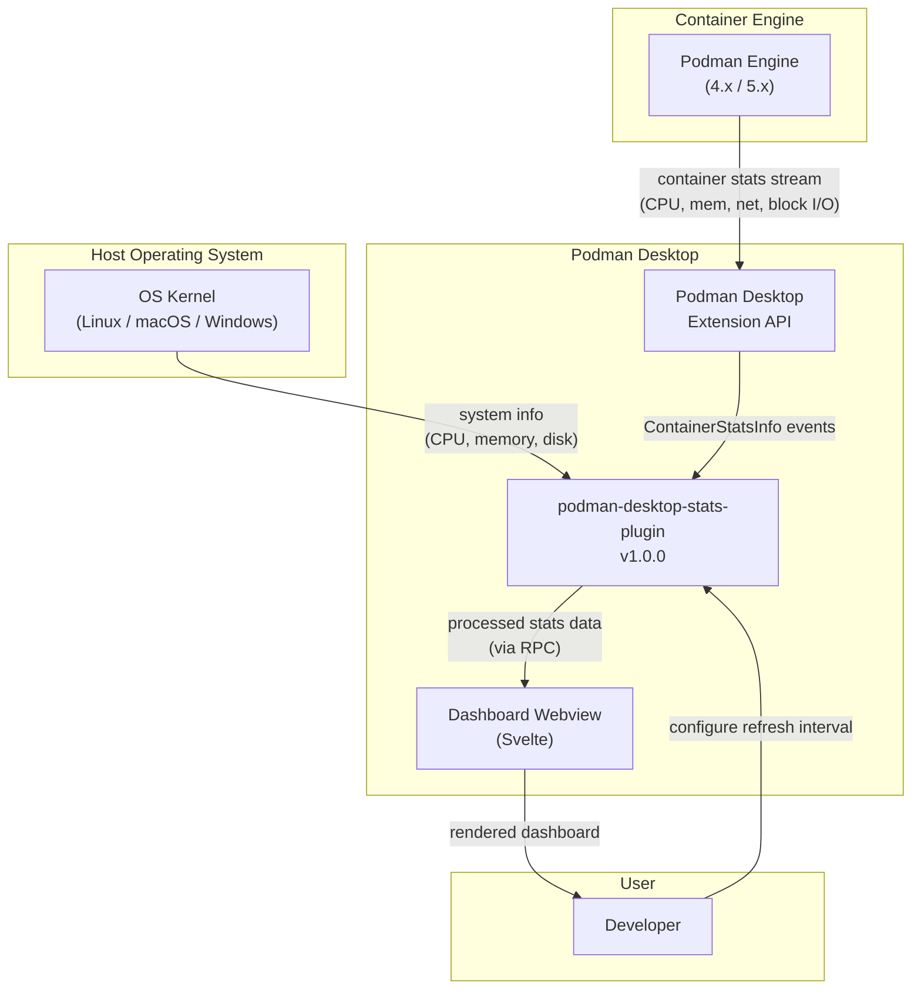
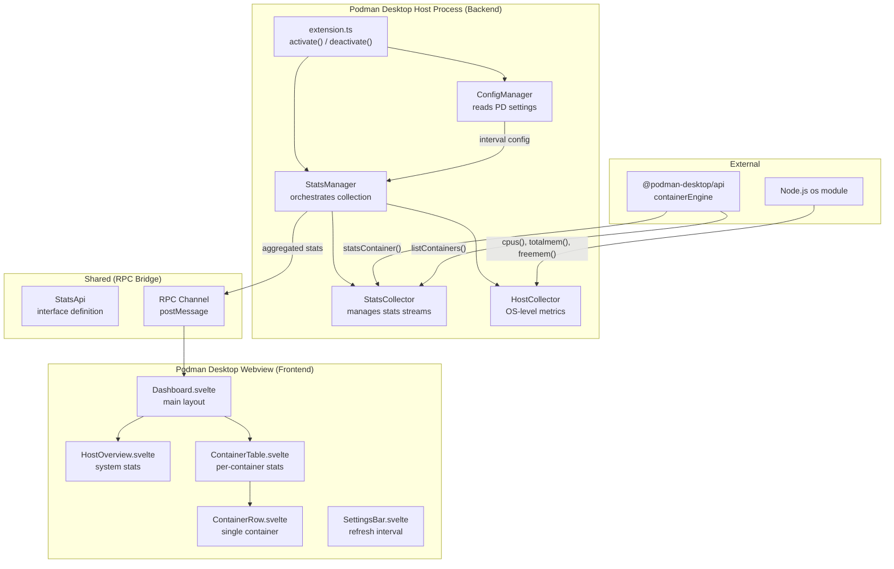
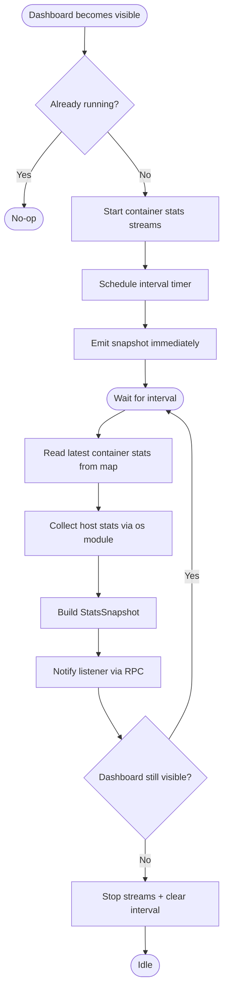
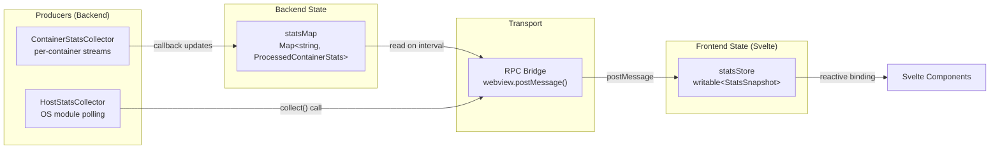

# podman-desktop-stats-plugin — Technical Architecture

**Version**: 1.0.0
**Date**: 2026-02-18
**JIRA**: N/A
**Author**: dhenry
**Methodology**: TDD (Test-Driven Development), Incremental Delivery
**Target coverage**: > 80%

---

## Table of Contents

1. [Executive Summary](#1-executive-summary)
2. [System Context](#2-system-context)
3. [Architecture Overview](#3-architecture-overview)
4. [Detailed Components](#4-detailed-components)
5. [Data Structures](#5-data-structures)
6. [Business Logic Layer](#6-business-logic-layer)
7. [Adapter Layer](#7-adapter-layer)
8. [Shared State Management](#8-shared-state-management)
9. [Metrics and Observability](#9-metrics-and-observability)
10. [Security](#10-security)
11. [Deployment](#11-deployment)
12. [Configuration](#12-configuration)
13. [Error Handling and Resilience](#13-error-handling-and-resilience)
14. [Project Structure](#14-project-structure)
15. [Testing Strategy](#15-testing-strategy)
16. [External Dependencies](#16-external-dependencies)
17. [Performance Requirements](#17-performance-requirements)
18. [Operational Runbooks](#18-operational-runbooks)
19. [Dashboard Specification](#19-dashboard-specification)
20. [API and Interface Contracts](#20-api-and-interface-contracts)
21. [Metrics Reference](#21-metrics-reference)

---

## 1. Executive Summary

### 1.1 Purpose

The podman-desktop-stats-plugin is a Podman Desktop extension that provides real-time container and host system resource monitoring through a dedicated dashboard page. It solves the problem of developers needing to leave Podman Desktop and switch to the terminal to run `podman stats` or use external monitoring tools to understand container resource consumption.

The extension polls the Podman container engine via the `@podman-desktop/api` `containerEngine.statsContainer` method and the Node.js `os` module for host-level metrics, then renders the data in a Svelte-based webview dashboard embedded in Podman Desktop.

### 1.2 Key Characteristics

- **Read-only**: Never modifies containers, images, or Podman state — monitoring only
- **Lightweight**: Polling only occurs when the dashboard is visible; stops when navigated away
- **Cross-platform**: Works on Linux, macOS, and Windows
- **User-configurable**: Refresh interval is configurable through extension settings (1-30 seconds, default 3s)
- **Multi-engine aware**: Works across all container engines registered in Podman Desktop (Podman 4.x and 5.x)
- **Graceful degradation**: Handles containers being removed mid-poll without UI errors
- **Standard PD extension**: Follows the official extension-template-full pattern (backend + frontend + shared packages)

### 1.3 Scope

**In Scope**:
1. Per-container CPU usage (percentage)
2. Per-container memory usage (used / limit, percentage)
3. Per-container network I/O (bytes sent / received)
4. Per-container disk/block I/O (bytes read / written)
5. Host system overview (CPU usage, memory usage, disk usage)
6. Dedicated dashboard page in Podman Desktop navigation
7. User-configurable refresh interval via extension settings
8. Support for Podman 4.x and 5.x (rootless mode)

**Out of Scope**:
1. Historical data persistence or time-series storage
2. Alerting or notifications for resource thresholds
3. Status bar widget
4. Pod-level aggregated stats
5. Remote Podman machine monitoring
6. Export/import of stats data

---

## 2. System Context

### 2.1 Context Diagram



### 2.2 Actors and Interfaces

| Actor | Type | Interface | Data Flow |
|-------|------|-----------|-----------|
| Podman Engine | System | `containerEngine.statsContainer()` | IN — streams ContainerStatsInfo |
| Podman Engine | System | `containerEngine.listContainers()` | IN — lists running containers |
| Host OS | System | Node.js `os` module | IN — CPU, memory, disk info |
| Podman Desktop | System | Extension API (`@podman-desktop/api`) | BOTH — lifecycle, config, navigation |
| Developer | Human | Svelte webview dashboard | OUT — visual stats display |

---

## 3. Architecture Overview

### 3.1 High-Level Architecture



### 3.2 Architecture Decisions

#### AD-1: Extension Architecture Pattern — Multi-Package (Backend + Frontend + Shared)

**Decision**: Follow the official `extension-template-full` pattern with three packages: `packages/backend` (extension host code), `packages/frontend` (Svelte webview), and `packages/shared` (RPC interface definitions).

**Alternatives considered**:
- Single-package extension with inline HTML (simpler but no Svelte, poor maintainability)
- Two-package (backend + frontend) without shared types (duplicated type definitions)

**Reasons**:
1. **Official pattern**: This is the recommended production approach per Podman Desktop documentation
2. **Type safety**: Shared package ensures backend and frontend agree on data contracts
3. **Separation of concerns**: Backend (Node.js) and frontend (Svelte) have distinct build pipelines

**Trade-offs**:
- Advantage: Type-safe RPC communication between backend and frontend
- Advantage: Can use `@podman-desktop/ui-svelte` components in frontend
- Advantage: Frontend builds independently into `packages/backend/media/`
- Disadvantage: More complex project structure than a minimal extension
- Disadvantage: Requires npm workspaces and coordinated builds

#### AD-2: Stats Collection Strategy — PD Extension API (`containerEngine.statsContainer`)

**Decision**: Use the Podman Desktop Extension API's `containerEngine.statsContainer()` method to receive stats streams, rather than directly calling the Podman REST API.

**Alternatives considered**:
- Direct Podman REST API calls via HTTP to the Unix socket (`/libpod/containers/{id}/stats`)
- Spawning `podman stats --format json` as a child process

**Reasons**:
1. **API stability**: The extension API abstracts away Podman version differences (4.x vs 5.x)
2. **Multi-engine**: Works with any container engine registered in PD, not just Podman
3. **Permission**: No need to manage socket paths or permissions — PD handles this
4. **Lifecycle**: The API returns a `Disposable` for clean stream teardown

**Trade-offs**:
- Advantage: Version-agnostic, cross-platform, managed lifecycle
- Advantage: Receives typed `ContainerStatsInfo` objects
- Disadvantage: Dependent on PD API surface — if a field is missing from `ContainerStatsInfo`, we cannot access it
- Disadvantage: Callback-based streaming rather than request/response polling

#### AD-3: Host Stats Collection — Node.js `os` Module

**Decision**: Use Node.js built-in `os` module (`os.cpus()`, `os.totalmem()`, `os.freemem()`) for host-level CPU and memory stats. Use `containerEngine.info()` or `os` module for disk usage.

**Alternatives considered**:
- `containerEngine.info()` only (limited to what Podman reports)
- Third-party package like `systeminformation` (large dependency)
- Spawning `df`, `free`, etc. as child processes (platform-specific)

**Reasons**:
1. **Zero dependencies**: `os` module is built into Node.js, no additional packages needed
2. **Cross-platform**: `os.cpus()`, `os.totalmem()`, `os.freemem()` work on all platforms
3. **Lightweight**: No external process spawning

**Trade-offs**:
- Advantage: No additional dependencies
- Advantage: Works on all platforms PD supports
- Disadvantage: `os` module does not provide disk usage directly — will need `containerEngine.info()` or a small platform-specific call for disk stats
- Disadvantage: CPU usage requires two samples to compute delta (implemented as rolling comparison)

#### AD-4: Frontend Framework — Svelte 5 with `@podman-desktop/ui-svelte`

**Decision**: Use Svelte 5 (as used by current PD) with the official `@podman-desktop/ui-svelte` component library for consistent look and feel.

**Alternatives considered**:
- Raw HTML/CSS/JS (no framework)
- React (not used by PD)

**Reasons**:
1. **Consistency**: PD's own UI is Svelte-based; using Svelte ensures visual consistency
2. **Component library**: `@podman-desktop/ui-svelte` provides pre-built, themed components
3. **Performance**: Svelte compiles to minimal JavaScript with no runtime overhead

**Trade-offs**:
- Advantage: Consistent look and feel with native PD UI
- Advantage: Small bundle size
- Advantage: Pre-built components reduce development effort
- Disadvantage: Must track PD's Svelte version (currently Svelte 5)

#### AD-5: Data Flow — Polling with Configurable Interval

**Decision**: Poll container stats at a user-configurable interval (1-30 seconds, default 3 seconds). Start polling when the dashboard webview becomes visible; stop when it is hidden or disposed.

**Alternatives considered**:
- Continuous streaming (always-on stats subscription)
- Manual refresh button only

**Reasons**:
1. **Resource efficiency**: No background CPU/memory usage when user is not viewing the dashboard
2. **User control**: Different users have different responsiveness vs. performance preferences
3. **Simplicity**: Interval-based polling is straightforward to implement and reason about

**Trade-offs**:
- Advantage: Zero resource usage when dashboard is not visible
- Advantage: User controls the trade-off between freshness and overhead
- Disadvantage: Brief delay on first dashboard open while initial data loads
- Disadvantage: Data is not real-time (up to N seconds stale)

#### AD-6: State Management — Svelte Stores (Frontend) + In-Memory Maps (Backend)

**Decision**: Backend maintains an in-memory `Map<string, ProcessedContainerStats>` keyed by container ID. Frontend uses Svelte writable stores to reactively update the UI.

**Alternatives considered**:
- Redux/global state library (overkill for this scope)
- Backend-only state with full-page refresh (poor UX)

**Reasons**:
1. **Simplicity**: A Map on the backend and Svelte stores on the frontend is the minimal viable approach
2. **Reactivity**: Svelte stores automatically trigger UI re-renders on data change
3. **No persistence needed**: Stats are ephemeral — no need for localStorage or IndexedDB

**Trade-offs**:
- Advantage: Minimal code, no extra dependencies
- Advantage: Natural fit for Svelte's reactivity model
- Disadvantage: All state lost on extension deactivation (acceptable for real-time stats)
- Disadvantage: No historical data retention (out of scope for v1.0)

---

## 4. Detailed Components

### 4.1 Extension Entry Point (`extension.ts`)

#### Responsibilities
1. Register the extension with Podman Desktop on `activate()`
2. Create the webview panel for the dashboard
3. Initialize `StatsManager` and `ConfigManager`
4. Wire up RPC communication between backend and frontend
5. Clean up all resources on `deactivate()`

#### Implementation

```typescript
// packages/backend/src/extension.ts
import * as podmanDesktopAPI from '@podman-desktop/api';
import { StatsManager } from './stats-manager';
import { ConfigManager } from './config-manager';
import { RpcBridge } from './rpc-bridge';

let statsManager: StatsManager | undefined;

export async function activate(
  extensionContext: podmanDesktopAPI.ExtensionContext,
): Promise<void> {
  const configManager = new ConfigManager(extensionContext);

  const panel = podmanDesktopAPI.window.createWebviewPanel(
    'container-stats',
    'Container Stats',
    {},
  );

  statsManager = new StatsManager(configManager);
  const rpcBridge = new RpcBridge(panel.webview, statsManager);

  // Start/stop polling based on webview visibility
  panel.onDidChangeViewState(({ webviewPanel }) => {
    if (webviewPanel.visible) {
      statsManager?.start();
    } else {
      statsManager?.stop();
    }
  });

  extensionContext.subscriptions.push(panel);
  extensionContext.subscriptions.push(rpcBridge);
  extensionContext.subscriptions.push({
    dispose: () => {
      statsManager?.stop();
      statsManager = undefined;
    },
  });
}

export async function deactivate(): Promise<void> {
  statsManager?.stop();
  statsManager = undefined;
}
```

### 4.2 StatsManager

#### Responsibilities
1. Orchestrate container stats collection and host stats collection
2. Manage polling lifecycle (start/stop based on dashboard visibility)
3. Aggregate stats from multiple containers and the host
4. Notify listeners (RPC bridge) when new data is available

#### Interface

```typescript
// packages/backend/src/stats-manager.ts
import { ContainerStats, HostStats, StatsSnapshot } from '@podman-desktop-stats/shared';
import { ConfigManager } from './config-manager';

export interface StatsListener {
  onStatsUpdate(snapshot: StatsSnapshot): void;
}

export class StatsManager {
  private containerCollector: ContainerStatsCollector;
  private hostCollector: HostStatsCollector;
  private listener: StatsListener | undefined;
  private intervalHandle: ReturnType<typeof setInterval> | undefined;
  private running: boolean = false;

  constructor(private configManager: ConfigManager) {
    this.containerCollector = new ContainerStatsCollector();
    this.hostCollector = new HostStatsCollector();
  }

  setListener(listener: StatsListener): void {
    this.listener = listener;
  }

  async start(): Promise<void> {
    if (this.running) return;
    this.running = true;
    await this.containerCollector.startStreams();
    this.schedulePolling();
  }

  stop(): void {
    if (!this.running) return;
    this.running = false;
    this.containerCollector.stopStreams();
    if (this.intervalHandle) {
      clearInterval(this.intervalHandle);
      this.intervalHandle = undefined;
    }
  }

  private schedulePolling(): void {
    const intervalMs = this.configManager.getRefreshIntervalMs();
    this.intervalHandle = setInterval(() => {
      this.emitSnapshot();
    }, intervalMs);
    // Emit immediately on start
    this.emitSnapshot();
  }

  private emitSnapshot(): void {
    const snapshot: StatsSnapshot = {
      timestamp: Date.now(),
      containers: this.containerCollector.getLatestStats(),
      host: this.hostCollector.collect(),
    };
    this.listener?.onStatsUpdate(snapshot);
  }
}
```

#### Flow Diagram



### 4.3 ContainerStatsCollector

#### Responsibilities
1. List all running containers via `containerEngine.listContainers()`
2. Subscribe to stats streams for each running container via `containerEngine.statsContainer()`
3. Maintain an in-memory map of latest stats per container
4. Handle containers being added/removed during polling
5. Clean up stats stream disposables

#### Implementation

```typescript
// packages/backend/src/container-stats-collector.ts
import * as podmanDesktopAPI from '@podman-desktop/api';
import { ProcessedContainerStats } from '@podman-desktop-stats/shared';
import { computeContainerStats } from './stats-calculator';

export class ContainerStatsCollector {
  private statsMap: Map<string, ProcessedContainerStats> = new Map();
  private disposables: Map<string, podmanDesktopAPI.Disposable> = new Map();

  async startStreams(): Promise<void> {
    const containers = await podmanDesktopAPI.containerEngine.listContainers();
    const running = containers.filter(c => c.State === 'running');

    for (const container of running) {
      await this.subscribeToContainer(container);
    }
  }

  private async subscribeToContainer(
    container: podmanDesktopAPI.ContainerInfo,
  ): Promise<void> {
    const key = container.Id;
    if (this.disposables.has(key)) return;

    try {
      const disposable = await podmanDesktopAPI.containerEngine.statsContainer(
        container.engineId,
        container.Id,
        (stats: podmanDesktopAPI.ContainerStatsInfo) => {
          const processed = computeContainerStats(
            container,
            stats,
            this.statsMap.get(key),
          );
          this.statsMap.set(key, processed);
        },
      );
      this.disposables.set(key, disposable);
    } catch {
      // Container may have stopped between list and subscribe — ignore
    }
  }

  stopStreams(): void {
    for (const disposable of this.disposables.values()) {
      disposable.dispose();
    }
    this.disposables.clear();
    this.statsMap.clear();
  }

  getLatestStats(): ProcessedContainerStats[] {
    return Array.from(this.statsMap.values());
  }

  async refreshContainerList(): Promise<void> {
    const containers = await podmanDesktopAPI.containerEngine.listContainers();
    const running = containers.filter(c => c.State === 'running');
    const runningIds = new Set(running.map(c => c.Id));

    // Remove streams for stopped containers
    for (const [id, disposable] of this.disposables) {
      if (!runningIds.has(id)) {
        disposable.dispose();
        this.disposables.delete(id);
        this.statsMap.delete(id);
      }
    }

    // Add streams for new containers
    for (const container of running) {
      if (!this.disposables.has(container.Id)) {
        await this.subscribeToContainer(container);
      }
    }
  }
}
```

### 4.4 HostStatsCollector

#### Responsibilities
1. Collect host CPU usage by computing delta between `os.cpus()` samples
2. Collect host memory usage via `os.totalmem()` and `os.freemem()`
3. Collect disk usage via Podman `containerEngine.info()` or Node.js APIs

#### Implementation

```typescript
// packages/backend/src/host-stats-collector.ts
import * as os from 'node:os';
import { HostStats, CpuTimes } from '@podman-desktop-stats/shared';

export class HostStatsCollector {
  private previousCpuTimes: CpuTimes | undefined;

  collect(): HostStats {
    const cpuUsagePercent = this.computeCpuUsage();
    const totalMemory = os.totalmem();
    const freeMemory = os.freemem();
    const usedMemory = totalMemory - freeMemory;

    return {
      cpuUsagePercent,
      cpuCount: os.cpus().length,
      memoryTotal: totalMemory,
      memoryUsed: usedMemory,
      memoryFree: freeMemory,
      memoryUsagePercent: (usedMemory / totalMemory) * 100,
      uptime: os.uptime(),
      platform: os.platform(),
      hostname: os.hostname(),
    };
  }

  private computeCpuUsage(): number {
    const cpus = os.cpus();
    const currentTimes = this.aggregateCpuTimes(cpus);

    if (!this.previousCpuTimes) {
      this.previousCpuTimes = currentTimes;
      return 0;
    }

    const idleDelta = currentTimes.idle - this.previousCpuTimes.idle;
    const totalDelta = currentTimes.total - this.previousCpuTimes.total;

    this.previousCpuTimes = currentTimes;

    if (totalDelta === 0) return 0;
    return ((totalDelta - idleDelta) / totalDelta) * 100;
  }

  private aggregateCpuTimes(cpus: os.CpuInfo[]): CpuTimes {
    let idle = 0;
    let total = 0;
    for (const cpu of cpus) {
      idle += cpu.times.idle;
      total += cpu.times.user + cpu.times.nice + cpu.times.sys + cpu.times.idle + cpu.times.irq;
    }
    return { idle, total };
  }
}
```

### 4.5 ConfigManager

#### Responsibilities
1. Read extension configuration from Podman Desktop settings
2. Provide default values for unconfigured settings
3. Listen for configuration changes and notify subscribers

#### Implementation

```typescript
// packages/backend/src/config-manager.ts
import * as podmanDesktopAPI from '@podman-desktop/api';

const CONFIG_SECTION = 'containerStats';
const DEFAULT_REFRESH_INTERVAL_S = 3;
const MIN_REFRESH_INTERVAL_S = 1;
const MAX_REFRESH_INTERVAL_S = 30;

export class ConfigManager {
  constructor(private extensionContext: podmanDesktopAPI.ExtensionContext) {}

  getRefreshIntervalMs(): number {
    const config = podmanDesktopAPI.configuration.getConfiguration(CONFIG_SECTION);
    const value = config.get<number>('refreshInterval') ?? DEFAULT_REFRESH_INTERVAL_S;
    const clamped = Math.max(MIN_REFRESH_INTERVAL_S, Math.min(MAX_REFRESH_INTERVAL_S, value));
    return clamped * 1000;
  }

  getRefreshIntervalSeconds(): number {
    return this.getRefreshIntervalMs() / 1000;
  }

  onDidChangeConfiguration(callback: () => void): podmanDesktopAPI.Disposable {
    return podmanDesktopAPI.configuration.onDidChangeConfiguration(e => {
      if (e.key.startsWith(`${CONFIG_SECTION}.`)) {
        callback();
      }
    });
  }
}
```

### 4.6 RpcBridge

#### Responsibilities
1. Bridge communication between backend `StatsManager` and frontend webview
2. Serialize `StatsSnapshot` and send via `webview.postMessage()`
3. Receive commands from frontend (e.g., request immediate refresh)
4. Implement `StatsListener` to receive update notifications

#### Implementation

```typescript
// packages/backend/src/rpc-bridge.ts
import * as podmanDesktopAPI from '@podman-desktop/api';
import { StatsSnapshot, RpcMessage, RpcCommand } from '@podman-desktop-stats/shared';
import { StatsManager, StatsListener } from './stats-manager';

export class RpcBridge implements StatsListener, podmanDesktopAPI.Disposable {
  private disposable: podmanDesktopAPI.Disposable;

  constructor(
    private webview: podmanDesktopAPI.Webview,
    private statsManager: StatsManager,
  ) {
    this.statsManager.setListener(this);

    this.disposable = webview.onDidReceiveMessage((message: RpcCommand) => {
      this.handleCommand(message);
    });
  }

  onStatsUpdate(snapshot: StatsSnapshot): void {
    const message: RpcMessage = {
      type: 'stats-update',
      payload: snapshot,
    };
    this.webview.postMessage(message);
  }

  private handleCommand(command: RpcCommand): void {
    switch (command.type) {
      case 'request-refresh':
        // Trigger immediate snapshot emission
        this.statsManager.emitSnapshot();
        break;
      case 'set-interval':
        // Handled via PD configuration, not direct RPC
        break;
    }
  }

  dispose(): void {
    this.disposable.dispose();
  }
}
```

---

## 5. Data Structures

### 5.1 ProcessedContainerStats

```typescript
// packages/shared/src/types.ts

/** Processed container stats ready for display */
export interface ProcessedContainerStats {
  /** Container ID (from Podman) */
  id: string;
  /** Container name(s) */
  name: string;
  /** Container image name */
  image: string;
  /** Container state (should always be "running" for active stats) */
  state: string;
  /** Engine ID that manages this container */
  engineId: string;
  /** CPU usage as a percentage (0-100+, can exceed 100 on multi-core) */
  cpuUsagePercent: number;
  /** Memory used in bytes */
  memoryUsed: number;
  /** Memory limit in bytes (0 = no limit) */
  memoryLimit: number;
  /** Memory usage as a percentage (0-100) */
  memoryUsagePercent: number;
  /** Network bytes received */
  networkRx: number;
  /** Network bytes transmitted */
  networkTx: number;
  /** Block I/O bytes read */
  blockRead: number;
  /** Block I/O bytes written */
  blockWrite: number;
  /** Number of PIDs in the container */
  pids: number;
  /** Timestamp of this stats reading */
  timestamp: number;
}
```

| Field | Type | Source | Description |
|-------|------|--------|-------------|
| id | string | ContainerInfo.Id | Unique container identifier |
| name | string | ContainerInfo.Names[0] | First container name |
| image | string | ContainerInfo.Image | Image used to create container |
| state | string | ContainerInfo.State | Container runtime state |
| engineId | string | ContainerInfo.engineId | Engine managing this container |
| cpuUsagePercent | number | Computed from cpu_stats delta | CPU usage percentage |
| memoryUsed | number | memory_stats.usage | Current memory consumption |
| memoryLimit | number | memory_stats.limit | Memory limit (0 = unlimited) |
| memoryUsagePercent | number | Computed from usage/limit | Memory as percentage |
| networkRx | number | Summed from networks[*].rx_bytes | Total bytes received |
| networkTx | number | Summed from networks[*].tx_bytes | Total bytes transmitted |
| blockRead | number | Summed from blkio_stats read ops | Total block bytes read |
| blockWrite | number | Summed from blkio_stats write ops | Total block bytes written |
| pids | number | pids_stats.current | Current PID count |
| timestamp | number | Date.now() | When this snapshot was taken |

### 5.2 HostStats

```typescript
// packages/shared/src/types.ts

/** Host system resource statistics */
export interface HostStats {
  /** CPU usage as a percentage (0-100) */
  cpuUsagePercent: number;
  /** Number of logical CPU cores */
  cpuCount: number;
  /** Total physical memory in bytes */
  memoryTotal: number;
  /** Used memory in bytes */
  memoryUsed: number;
  /** Free memory in bytes */
  memoryFree: number;
  /** Memory usage as a percentage (0-100) */
  memoryUsagePercent: number;
  /** System uptime in seconds */
  uptime: number;
  /** OS platform identifier */
  platform: string;
  /** Hostname */
  hostname: string;
}
```

| Field | Type | Source | Description |
|-------|------|--------|-------------|
| cpuUsagePercent | number | Computed from os.cpus() delta | Host CPU usage |
| cpuCount | number | os.cpus().length | Logical CPU count |
| memoryTotal | number | os.totalmem() | Total RAM in bytes |
| memoryUsed | number | total - free | Used RAM in bytes |
| memoryFree | number | os.freemem() | Free RAM in bytes |
| memoryUsagePercent | number | used / total * 100 | RAM usage percentage |
| uptime | number | os.uptime() | Seconds since boot |
| platform | string | os.platform() | e.g., "linux", "darwin", "win32" |
| hostname | string | os.hostname() | Machine hostname |

### 5.3 StatsSnapshot

```typescript
// packages/shared/src/types.ts

/** A complete snapshot of all stats at a point in time */
export interface StatsSnapshot {
  /** Timestamp when snapshot was assembled (ms since epoch) */
  timestamp: number;
  /** Stats for all currently running containers */
  containers: ProcessedContainerStats[];
  /** Host system stats */
  host: HostStats;
}
```

### 5.4 RPC Message Types

```typescript
// packages/shared/src/rpc-types.ts

/** Message sent from backend to frontend */
export interface RpcMessage {
  type: 'stats-update';
  payload: StatsSnapshot;
}

/** Command sent from frontend to backend */
export interface RpcCommand {
  type: 'request-refresh' | 'set-interval';
  payload?: unknown;
}
```

### 5.5 CpuTimes (Internal)

```typescript
// packages/backend/src/host-stats-collector.ts

/** Aggregated CPU times for delta computation */
export interface CpuTimes {
  idle: number;
  total: number;
}
```

---

## 6. Business Logic Layer

### 6.1 Container CPU Usage Calculation

#### Algorithm

```
1. Receive current ContainerStatsInfo (with cpu_stats and precpu_stats)
2. Compute CPU delta = cpu_stats.cpu_usage.total_usage - precpu_stats.cpu_usage.total_usage
3. Compute system delta = cpu_stats.system_cpu_usage - precpu_stats.system_cpu_usage
4. If system delta is 0, return 0% (avoid division by zero)
5. Compute percentage = (CPU delta / system delta) * online_cpus * 100
6. Clamp result to >= 0
7. Return percentage
```

#### Implementation

```typescript
// packages/backend/src/stats-calculator.ts
import * as podmanDesktopAPI from '@podman-desktop/api';
import { ProcessedContainerStats } from '@podman-desktop-stats/shared';

export function computeCpuPercent(
  stats: podmanDesktopAPI.ContainerStatsInfo,
): number {
  const cpuDelta =
    stats.cpu_stats.cpu_usage.total_usage -
    stats.precpu_stats.cpu_usage.total_usage;
  const systemDelta =
    stats.cpu_stats.system_cpu_usage - stats.precpu_stats.system_cpu_usage;

  if (systemDelta === 0 || cpuDelta < 0) return 0;

  const onlineCpus = stats.cpu_stats.online_cpus || 1;
  return (cpuDelta / systemDelta) * onlineCpus * 100;
}
```

#### Edge Cases

| Case | Input | Expected Output | Handling |
|------|-------|----------------|----------|
| First sample | precpu_stats all zeros | 0% | systemDelta = 0, return 0 |
| Container paused | No new stats received | Last known value in map | Map retains previous entry |
| Multi-core > 100% | cpuDelta > systemDelta | > 100% | Valid — container uses multiple cores |
| Negative delta | Container restarted | 0% | cpuDelta < 0 check |

### 6.2 Memory Usage Calculation

#### Algorithm

```
1. Read memory_stats.usage from ContainerStatsInfo
2. Read memory_stats.limit from ContainerStatsInfo
3. If limit is 0 or matches host total memory, treat as "no limit"
4. Compute percentage = (usage / limit) * 100
5. Return { used, limit, percent }
```

#### Implementation

```typescript
// packages/backend/src/stats-calculator.ts

export function computeMemoryUsage(
  stats: podmanDesktopAPI.ContainerStatsInfo,
): { used: number; limit: number; percent: number } {
  const used = stats.memory_stats.usage ?? 0;
  const limit = stats.memory_stats.limit ?? 0;

  if (limit === 0) {
    return { used, limit: 0, percent: 0 };
  }

  const percent = (used / limit) * 100;
  return { used, limit, percent };
}
```

#### Edge Cases

| Case | Input | Expected Output | Handling |
|------|-------|----------------|----------|
| No memory limit | limit = 0 | 0% (unlimited) | Special case: return 0% with limit=0 |
| Very high limit | limit = host total RAM | Shows percentage normally | No special handling needed |
| Zero usage | usage = 0 | 0% | Normal computation |

### 6.3 Network I/O Aggregation

#### Algorithm

```
1. Read networks object from ContainerStatsInfo (keyed by interface name)
2. Sum rx_bytes across all interfaces
3. Sum tx_bytes across all interfaces
4. Return { rx, tx }
```

#### Implementation

```typescript
// packages/backend/src/stats-calculator.ts

export function computeNetworkIO(
  stats: podmanDesktopAPI.ContainerStatsInfo,
): { rx: number; tx: number } {
  let rx = 0;
  let tx = 0;

  if (stats.networks) {
    for (const iface of Object.values(stats.networks)) {
      const netIface = iface as { rx_bytes?: number; tx_bytes?: number };
      rx += netIface.rx_bytes ?? 0;
      tx += netIface.tx_bytes ?? 0;
    }
  }

  return { rx, tx };
}
```

### 6.4 Block I/O Aggregation

#### Algorithm

```
1. Read blkio_stats from ContainerStatsInfo
2. If blkio_stats or io_service_bytes_recursive is undefined, return { read: 0, write: 0 }
3. Sum values where op === "read" (or "Read")
4. Sum values where op === "write" (or "Write")
5. Return { read, write }
```

#### Implementation

```typescript
// packages/backend/src/stats-calculator.ts

export function computeBlockIO(
  stats: podmanDesktopAPI.ContainerStatsInfo,
): { read: number; write: number } {
  let read = 0;
  let write = 0;

  const blkio = stats.blkio_stats;
  if (!blkio?.io_service_bytes_recursive) {
    return { read, write };
  }

  for (const entry of blkio.io_service_bytes_recursive) {
    const op = (entry.op ?? '').toLowerCase();
    if (op === 'read') {
      read += entry.value ?? 0;
    } else if (op === 'write') {
      write += entry.value ?? 0;
    }
  }

  return { read, write };
}
```

### 6.5 Full Container Stats Computation

```typescript
// packages/backend/src/stats-calculator.ts

export function computeContainerStats(
  container: podmanDesktopAPI.ContainerInfo,
  stats: podmanDesktopAPI.ContainerStatsInfo,
  _previous: ProcessedContainerStats | undefined,
): ProcessedContainerStats {
  const cpuUsagePercent = computeCpuPercent(stats);
  const memory = computeMemoryUsage(stats);
  const network = computeNetworkIO(stats);
  const blockIO = computeBlockIO(stats);

  return {
    id: container.Id,
    name: container.Names?.[0] ?? container.Id.substring(0, 12),
    image: container.Image ?? 'unknown',
    state: container.State ?? 'running',
    engineId: container.engineId,
    cpuUsagePercent,
    memoryUsed: memory.used,
    memoryLimit: memory.limit,
    memoryUsagePercent: memory.percent,
    networkRx: network.rx,
    networkTx: network.tx,
    blockRead: blockIO.read,
    blockWrite: blockIO.write,
    pids: stats.pids_stats?.current ?? 0,
    timestamp: Date.now(),
  };
}
```

### 6.6 Byte Formatting Utility

```typescript
// packages/shared/src/format.ts

const UNITS = ['B', 'KB', 'MB', 'GB', 'TB'];

export function formatBytes(bytes: number, decimals: number = 1): string {
  if (bytes === 0) return '0 B';
  if (bytes < 0) return '-' + formatBytes(-bytes, decimals);

  const k = 1024;
  const i = Math.floor(Math.log(bytes) / Math.log(k));
  const index = Math.min(i, UNITS.length - 1);
  const value = bytes / Math.pow(k, index);

  return `${value.toFixed(decimals)} ${UNITS[index]}`;
}

export function formatPercent(value: number, decimals: number = 1): string {
  return `${value.toFixed(decimals)}%`;
}

export function formatUptime(seconds: number): string {
  const days = Math.floor(seconds / 86400);
  const hours = Math.floor((seconds % 86400) / 3600);
  const mins = Math.floor((seconds % 3600) / 60);

  if (days > 0) return `${days}d ${hours}h`;
  if (hours > 0) return `${hours}h ${mins}m`;
  return `${mins}m`;
}
```

---

## 7. Adapter Layer

### 7.1 Podman Desktop Extension API Adapter

#### Purpose
Wraps `@podman-desktop/api` calls to provide a testable interface. In production, calls the real API. In tests, a mock implementation is injected.

#### Implementation

```typescript
// packages/backend/src/adapters/container-engine-adapter.ts
import * as podmanDesktopAPI from '@podman-desktop/api';

export interface ContainerEnginePort {
  listContainers(): Promise<podmanDesktopAPI.ContainerInfo[]>;
  statsContainer(
    engineId: string,
    containerId: string,
    callback: (stats: podmanDesktopAPI.ContainerStatsInfo) => void,
  ): Promise<podmanDesktopAPI.Disposable>;
}

export class PodmanDesktopContainerEngine implements ContainerEnginePort {
  async listContainers(): Promise<podmanDesktopAPI.ContainerInfo[]> {
    return podmanDesktopAPI.containerEngine.listContainers();
  }

  async statsContainer(
    engineId: string,
    containerId: string,
    callback: (stats: podmanDesktopAPI.ContainerStatsInfo) => void,
  ): Promise<podmanDesktopAPI.Disposable> {
    return podmanDesktopAPI.containerEngine.statsContainer(
      engineId,
      containerId,
      callback,
    );
  }
}
```

#### Setup/Registration

The adapter is instantiated in `extension.ts` and injected into `ContainerStatsCollector`:

```typescript
// packages/backend/src/extension.ts (excerpt)
const engineAdapter = new PodmanDesktopContainerEngine();
const containerCollector = new ContainerStatsCollector(engineAdapter);
```

### 7.2 OS Adapter

#### Purpose
Wraps Node.js `os` module calls for testability.

#### Implementation

```typescript
// packages/backend/src/adapters/os-adapter.ts
import * as os from 'node:os';

export interface OsPort {
  cpus(): os.CpuInfo[];
  totalmem(): number;
  freemem(): number;
  uptime(): number;
  platform(): NodeJS.Platform;
  hostname(): string;
}

export class NodeOsAdapter implements OsPort {
  cpus(): os.CpuInfo[] { return os.cpus(); }
  totalmem(): number { return os.totalmem(); }
  freemem(): number { return os.freemem(); }
  uptime(): number { return os.uptime(); }
  platform(): NodeJS.Platform { return os.platform(); }
  hostname(): string { return os.hostname(); }
}
```

---

## 8. Shared State Management

### 8.1 State Overview



### 8.2 Backend Stats Map

The `ContainerStatsCollector` maintains a `Map<string, ProcessedContainerStats>` that is updated by per-container stats stream callbacks. This map is single-threaded (Node.js event loop) so no synchronization is needed.

**State Rebuild on Restart**: The extension does not persist state. On deactivation and reactivation, streams are re-established and the map is repopulated from fresh stats. Since all data is ephemeral real-time stats, there is no need for state recovery.

### 8.3 Frontend Svelte Store

```typescript
// packages/frontend/src/stores/stats-store.ts
import { writable } from 'svelte/store';
import type { StatsSnapshot } from '@podman-desktop-stats/shared';

export const statsSnapshot = writable<StatsSnapshot | undefined>(undefined);

export function initStatsListener(): void {
  window.addEventListener('message', (event: MessageEvent) => {
    const message = event.data;
    if (message?.type === 'stats-update') {
      statsSnapshot.set(message.payload);
    }
  });
}
```

---

## 9. Metrics and Observability

### 9.1 Note on Metrics

This is a desktop extension, not a server-side application. There are no Prometheus metrics, health endpoints, or server-side observability.

Observability for this extension consists of:
- **Console logging** in the backend (visible via PD developer tools)
- **Webview devtools** for frontend debugging (right-click extension icon > "Open Devtools of the webview")

### 9.2 Logging Strategy

```typescript
// packages/backend/src/logger.ts

export function log(message: string, ...args: unknown[]): void {
  console.log(`[container-stats] ${message}`, ...args);
}

export function warn(message: string, ...args: unknown[]): void {
  console.warn(`[container-stats] ${message}`, ...args);
}

export function error(message: string, ...args: unknown[]): void {
  console.error(`[container-stats] ${message}`, ...args);
}
```

Log events:
- Extension activated / deactivated
- Stats collection started / stopped
- Container stream subscription failures (warn level)
- Configuration changes

---

## 10. Security

### 10.1 Extension Security

This extension has a minimal security surface:

| Property | Value | Notes |
|----------|-------|-------|
| Network calls | None | All data from local Podman socket |
| Filesystem writes | None | Read-only extension |
| Secrets/credentials | None | No authentication needed |
| Elevated privileges | None | Works with rootless Podman |
| External dependencies at runtime | None | Only PD API and Node.js built-ins |

### 10.2 Permissions

The extension only uses read-only operations:
- `containerEngine.listContainers()` — lists containers
- `containerEngine.statsContainer()` — streams stats for a container
- `containerEngine.info()` — reads system info
- `os.*` — reads system metrics

No container mutations (create, start, stop, delete) are performed.

### 10.3 Webview Security

The webview runs in a sandboxed iframe within Podman Desktop. It communicates with the backend exclusively via `postMessage()` / `onDidReceiveMessage()`. No external resources are loaded.

---

## 11. Deployment

### 11.1 Build

The extension is built as an npm package/OCI image. No Dockerfile is needed for the extension itself — PD extensions are loaded directly from a folder or an OCI registry.

```json
// packages/backend/package.json (build-relevant section)
{
  "scripts": {
    "build": "vite build",
    "watch": "vite build --watch"
  }
}
```

The build pipeline:
1. `packages/shared` — compiled first (TypeScript to JS)
2. `packages/frontend` — Svelte compiled to static assets, output to `packages/backend/media/`
3. `packages/backend` — TypeScript compiled, bundles the extension entry point

### 11.2 Environment Configurations

| Environment | Build Mode | Logging | Source Maps |
|-------------|-----------|---------|-------------|
| Development | `watch` mode, sideloaded | debug (verbose) | Yes |
| Production | `build` mode, published | info (errors/warnings only) | No |

### 11.3 Extension Packaging

```json
// packages/backend/package.json (extension manifest fields)
{
  "name": "podman-desktop-stats",
  "displayName": "Container Stats",
  "description": "Real-time container and host resource monitoring dashboard",
  "version": "1.0.0",
  "publisher": "dhenry",
  "license": "Apache-2.0",
  "icon": "icon.png",
  "engines": {
    "podman-desktop": "^1.17.0"
  },
  "main": "./dist/extension.js",
  "contributes": {
    "configuration": {
      "title": "Container Stats",
      "properties": {
        "containerStats.refreshInterval": {
          "type": "number",
          "default": 3,
          "minimum": 1,
          "maximum": 30,
          "description": "Stats refresh interval in seconds"
        }
      }
    }
  }
}
```

For loading during development:
1. Enable Development Mode in PD Settings > Extensions
2. Click "Local Extension" tab
3. Select the `packages/backend` folder

---

## 12. Configuration

### 12.1 Extension Settings

| Setting | Key | Type | Default | Min | Max | Description |
|---------|-----|------|---------|-----|-----|-------------|
| Refresh Interval | `containerStats.refreshInterval` | number | 3 | 1 | 30 | Stats refresh interval in seconds |

Configuration is managed through Podman Desktop's built-in settings UI. The extension reads it via `podmanDesktopAPI.configuration.getConfiguration('containerStats')`.

### 12.2 package.json `contributes.configuration`

```json
{
  "contributes": {
    "configuration": {
      "title": "Container Stats",
      "properties": {
        "containerStats.refreshInterval": {
          "type": "number",
          "default": 3,
          "minimum": 1,
          "maximum": 30,
          "description": "How often to refresh container and host stats (in seconds)"
        }
      }
    }
  }
}
```

---

## 13. Error Handling and Resilience

### 13.1 Error Categories

| Category | Handling | Example |
|----------|----------|---------|
| Transient | Log warning, continue polling | Stats stream disconnects temporarily |
| Container lifecycle | Remove from map, re-discover on next poll | Container removed while stats streaming |
| API unavailable | Log error, show "no data" in UI | Podman engine not running |
| Invalid data | Default to 0, log warning | NaN or undefined in stats fields |

### 13.2 Error Handling Pattern

```typescript
// General pattern for stats collection errors
try {
  const disposable = await containerEngine.statsContainer(engineId, id, callback);
  this.disposables.set(id, disposable);
} catch (err: unknown) {
  // Container may have stopped between list and subscribe
  warn(`Failed to subscribe to stats for container ${id}:`, err);
  // Do not throw — continue with other containers
}
```

### 13.3 Graceful Shutdown

On `deactivate()`:
1. Stop the polling interval (`clearInterval`)
2. Dispose all stats stream subscriptions (each `Disposable.dispose()`)
3. Clear the stats map
4. The webview panel is disposed by Podman Desktop via `extensionContext.subscriptions`

No asynchronous cleanup is needed — all operations are synchronous disposal.

---

## 14. Project Structure

```
podman-desktop-stats-plugin/
├── packages/
│   ├── backend/                         # Extension host process code
│   │   ├── src/
│   │   │   ├── extension.ts             # Entry point: activate() / deactivate()
│   │   │   ├── stats-manager.ts         # Orchestrates collection + emission
│   │   │   ├── container-stats-collector.ts  # Manages per-container streams
│   │   │   ├── host-stats-collector.ts  # Host CPU/memory via os module
│   │   │   ├── stats-calculator.ts      # Pure business logic (CPU%, mem%, I/O)
│   │   │   ├── config-manager.ts        # Extension settings reader
│   │   │   ├── rpc-bridge.ts            # Backend↔Frontend communication
│   │   │   ├── logger.ts               # Logging utilities
│   │   │   └── adapters/
│   │   │       ├── container-engine-adapter.ts  # PD API port + adapter
│   │   │       └── os-adapter.ts                # Node.js os port + adapter
│   │   ├── media/                       # Built frontend assets (generated)
│   │   ├── package.json                 # Extension manifest
│   │   ├── tsconfig.json
│   │   └── vite.config.ts
│   ├── frontend/                        # Svelte webview
│   │   ├── src/
│   │   │   ├── App.svelte               # Root component
│   │   │   ├── Dashboard.svelte         # Main dashboard layout
│   │   │   ├── components/
│   │   │   │   ├── HostOverview.svelte   # Host system stats panel
│   │   │   │   ├── ContainerTable.svelte # Container stats table
│   │   │   │   ├── ContainerRow.svelte   # Single container row
│   │   │   │   ├── StatsBar.svelte       # Visual progress bar for usage
│   │   │   │   └── SettingsBar.svelte    # Refresh interval display
│   │   │   ├── stores/
│   │   │   │   └── stats-store.ts        # Svelte writable store for snapshot
│   │   │   └── lib/
│   │   │       └── format.ts            # Re-export shared formatters
│   │   ├── index.html
│   │   ├── package.json
│   │   ├── tsconfig.json
│   │   ├── vite.config.ts
│   │   ├── svelte.config.js
│   │   └── tailwind.config.js
│   └── shared/                          # Shared types and utilities
│       ├── src/
│       │   ├── index.ts                 # Public exports
│       │   ├── types.ts                 # ProcessedContainerStats, HostStats, StatsSnapshot
│       │   ├── rpc-types.ts             # RpcMessage, RpcCommand
│       │   └── format.ts               # formatBytes, formatPercent, formatUptime
│       ├── package.json
│       └── tsconfig.json
├── __mocks__/                           # Mock definitions for testing
│   └── @podman-desktop/
│       └── api.ts                       # Mock PD Extension API
├── docs/
│   ├── PROJECT-KICKOFF.md
│   ├── ARCHITECTURE-1_0_0.md
│   └── DEVELOPMENT-SPEC-1_0_0.md
├── package.json                         # Root workspace configuration
├── tsconfig.base.json                   # Shared TypeScript config
├── vitest.config.ts                     # Test configuration
├── .eslintrc.json
├── .prettierrc
├── .gitignore
├── CHANGELOG.md
├── README.md
└── CLAUDE.md
```

**Important Notes**:
- `packages/backend/media/` is a generated directory — the frontend build outputs its assets here. It is gitignored.
- `packages/backend/package.json` serves dual purpose: npm package config AND Podman Desktop extension manifest.
- `packages/shared/` is a workspace dependency of both `backend` and `frontend`.
- `__mocks__/@podman-desktop/api.ts` provides a mock implementation of the PD API for unit tests.

---

## 15. Testing Strategy

### 15.1 Test Levels

| Level | Framework | Target | Scope |
|-------|-----------|--------|-------|
| Unit | Vitest | > 90% | Pure business logic in `stats-calculator.ts`, `format.ts` |
| Unit (adapters) | Vitest + mocks | > 80% | `StatsManager`, `ContainerStatsCollector`, `HostStatsCollector`, `ConfigManager` |
| Unit (UI) | Vitest + @testing-library/svelte | > 80% | Svelte components render correctly with given data |
| Integration | Vitest | Key flows | Full pipeline: collector → manager → RPC → store |

### 15.2 Test Infrastructure

- **Vitest**: Test runner for all packages (configured in root `vitest.config.ts` with workspace support)
- **@testing-library/svelte**: DOM testing for Svelte components
- **Mock PD API**: `__mocks__/@podman-desktop/api.ts` provides mock implementations of `containerEngine.listContainers`, `containerEngine.statsContainer`, `configuration.getConfiguration`, etc.
- **Mock OS module**: Test doubles for `os.cpus()`, `os.totalmem()`, etc.

### 15.3 Test Conventions

```typescript
// Example test: packages/backend/src/__tests__/stats-calculator.test.ts
import { describe, it, expect } from 'vitest';
import { computeCpuPercent, computeMemoryUsage, computeNetworkIO, computeBlockIO } from '../stats-calculator';
import { createMockStatsInfo } from '../../__mocks__/stats-fixtures';

describe('computeCpuPercent', () => {
  it('should compute CPU percentage from delta', () => {
    const stats = createMockStatsInfo({
      cpu_stats: {
        cpu_usage: { total_usage: 200_000_000 },
        system_cpu_usage: 1_000_000_000,
        online_cpus: 4,
      },
      precpu_stats: {
        cpu_usage: { total_usage: 100_000_000 },
        system_cpu_usage: 500_000_000,
        online_cpus: 4,
      },
    });

    const result = computeCpuPercent(stats);
    // (100M / 500M) * 4 * 100 = 80%
    expect(result).toBeCloseTo(80.0);
  });

  it('should return 0 when system delta is 0', () => {
    const stats = createMockStatsInfo({
      cpu_stats: {
        cpu_usage: { total_usage: 100 },
        system_cpu_usage: 500,
        online_cpus: 1,
      },
      precpu_stats: {
        cpu_usage: { total_usage: 100 },
        system_cpu_usage: 500,
        online_cpus: 1,
      },
    });

    expect(computeCpuPercent(stats)).toBe(0);
  });
});
```

---

## 16. External Dependencies

### 16.1 `@podman-desktop/api`

**Why**: Required to interact with Podman Desktop — container listing, stats streaming, configuration, webview panels.
**How consumed**: TypeScript type-only import (devDependency). At runtime, PD injects the API implementation.
**Version**: `latest` (tracks Podman Desktop releases)
**Fallback**: None — this is the extension platform itself.

### 16.2 `@podman-desktop/ui-svelte`

**Why**: Provides pre-built, themed UI components (tables, cards, buttons) that match PD's look and feel.
**How consumed**: npm dependency in `packages/frontend`
**Version**: `^1.22.0`
**Fallback**: Could use raw HTML/CSS, but would lose visual consistency with PD.

### 16.3 Svelte

**Why**: Frontend framework used by Podman Desktop for webview extensions.
**How consumed**: npm dependency in `packages/frontend`
**Version**: `^5.0.0` (Svelte 5, matching current PD)
**Fallback**: Could use Svelte 4 for older PD versions, but v1.17+ uses Svelte 5.

### 16.4 Vite

**Why**: Build tool for both backend (TypeScript bundling) and frontend (Svelte compilation).
**How consumed**: npm devDependency
**Version**: `^6.0.0`
**Fallback**: Could use Rollup or Webpack, but Vite is the PD-recommended bundler.

### 16.5 Vitest

**Why**: Test framework compatible with Vite, provides fast unit and integration testing.
**How consumed**: npm devDependency
**Version**: `^3.0.0`
**Fallback**: Jest (but Vitest integrates better with Vite).

### 16.6 TailwindCSS

**Why**: Utility-first CSS framework for consistent styling in the frontend webview.
**How consumed**: npm devDependency in `packages/frontend`
**Version**: `^4.0.0`
**Fallback**: Raw CSS or PD's built-in styles.

---

## 17. Performance Requirements

| Requirement | Target | Measurement |
|------------|--------|-------------|
| Extension activation time | < 500ms | Time from `activate()` call to webview panel registration |
| Stats snapshot assembly | < 50ms | Time to read stats map + collect host stats + serialize |
| Frontend render cycle | < 16ms (60fps) | Svelte component re-render on new snapshot |
| Memory overhead (backend) | < 20MB RSS | With 50 running containers |
| Memory overhead (frontend) | < 30MB | Webview process with dashboard rendered |
| CPU overhead (idle) | < 1% | When dashboard is not visible (no polling) |
| CPU overhead (active, 3s interval) | < 3% | During active polling with 20 containers |

---

## 18. Operational Runbooks

### 18.1 Extension Not Activating

**Symptoms**: Extension shows as "INACTIVE" or "ERROR" in PD Extensions list.
**Investigation**:
```bash
# Check PD logs (varies by platform)
# Linux: ~/.local/share/containers/podman-desktop/logs/
# macOS: ~/Library/Application Support/Podman Desktop/logs/
# Windows: %APPDATA%/Podman Desktop/logs/

# Or use PD developer tools: Help > Developer Tools > Console
```
**Resolution**:
1. Check that `packages/backend/dist/extension.js` exists (run `npm run build`)
2. Verify `package.json` has correct `main` field
3. Check PD version meets `engines.podman-desktop` requirement
4. Try removing and re-adding the extension

### 18.2 Stats Not Updating

**Symptoms**: Dashboard shows stale data or "No containers running" when containers exist.
**Investigation**:
1. Open PD developer tools and check console for `[container-stats]` log entries
2. Verify Podman engine is running (`podman info`)
3. Check if containers are in "running" state (`podman ps`)
**Resolution**:
1. Navigate away from and back to the dashboard (triggers stop/start cycle)
2. Check refresh interval in settings (may be set to a high value)
3. Restart the extension via PD Extensions page

### 18.3 High CPU Usage

**Symptoms**: System becomes sluggish while the stats dashboard is open.
**Investigation**:
1. Check refresh interval setting — a 1-second interval with many containers will use more CPU
2. Count running containers — each has its own stats stream
**Resolution**:
1. Increase the refresh interval to 5 or 10 seconds
2. This is expected behavior with many containers at low intervals

---

## 19. Dashboard Specification

### 19.1 Dashboard Overview

| Category | Panels | Description |
|----------|--------|-------------|
| Host Overview | 1 | System CPU, memory, and platform info |
| Container Stats | 1 | Table with all running containers and their stats |
| Settings | 1 | Current refresh interval and last update timestamp |

### 19.2 Panel Specifications

#### Panel: Host System Overview

| Property | Value |
|----------|-------|
| Type | Card with stat indicators |
| Layout | Horizontal row of stat cards |
| Data source | `StatsSnapshot.host` |
| Components | CPU gauge, memory gauge, uptime, platform |

Sub-panels within Host Overview:

| Stat | Display | Format |
|------|---------|--------|
| CPU Usage | Percentage + progress bar | `45.2%` |
| Memory | Used / Total + progress bar | `8.2 GB / 16.0 GB (51.3%)` |
| CPU Cores | Count | `8 cores` |
| Uptime | Duration | `3d 14h` |
| Platform | Text | `linux` |

#### Panel: Container Stats Table

| Property | Value |
|----------|-------|
| Type | Data table |
| Layout | Rows per container, columns per metric |
| Data source | `StatsSnapshot.containers[]` |
| Sort | Default by name, sortable columns |
| Empty state | "No running containers" message |

Table columns:

| Column | Field | Format | Sortable |
|--------|-------|--------|----------|
| Name | name | Text (truncated to 30 chars) | Yes |
| CPU % | cpuUsagePercent | `12.5%` + bar | Yes |
| Memory | memoryUsed / memoryLimit | `256 MB / 512 MB` + bar | Yes |
| Mem % | memoryUsagePercent | `50.0%` | Yes |
| Net RX | networkRx | `1.2 MB` | Yes |
| Net TX | networkTx | `340 KB` | Yes |
| Block Read | blockRead | `5.1 MB` | Yes |
| Block Write | blockWrite | `2.3 MB` | Yes |
| PIDs | pids | `42` | Yes |

#### Panel: Settings Bar

| Property | Value |
|----------|-------|
| Type | Compact bar at top of dashboard |
| Layout | Inline text + link to settings |
| Content | "Refreshing every {N}s — Last updated: {time}" |
| Action | Link to extension settings page |

### 19.3 Dashboard Layout

```
┌─────────────────────────────────────────────────────────────────┐
│  Settings Bar: Refreshing every 3s — Last updated: 14:32:05    │
├─────────────────────────────────────────────────────────────────┤
│  Host Overview                                                   │
│  ┌──────────┐  ┌──────────────────┐  ┌─────────┐  ┌──────────┐ │
│  │ CPU      │  │ Memory           │  │ Cores   │  │ Uptime   │ │
│  │ ██████░░ │  │ ████████░░░░░░░░ │  │ 8       │  │ 3d 14h   │ │
│  │ 45.2%    │  │ 8.2/16.0 GB      │  │         │  │          │ │
│  └──────────┘  └──────────────────┘  └─────────┘  └──────────┘ │
├─────────────────────────────────────────────────────────────────┤
│  Container Stats                                                 │
│  ┌───────────┬────────┬──────────────┬────────┬────────┬───────┐│
│  │ Name      │ CPU %  │ Memory       │ Net RX │ Net TX │ PIDs  ││
│  ├───────────┼────────┼──────────────┼────────┼────────┼───────┤│
│  │ web-app   │ 12.5%  │ 256M / 512M  │ 1.2 MB │ 340 KB │ 42   ││
│  │ postgres  │  3.1%  │ 128M / 256M  │ 45 KB  │ 12 KB  │ 8    ││
│  │ redis     │  0.5%  │  32M / 64M   │ 2 KB   │ 1 KB   │ 4    ││
│  └───────────┴────────┴──────────────┴────────┴────────┴───────┘│
└─────────────────────────────────────────────────────────────────┘
```

---

## 20. API and Interface Contracts

### 20.1 ContainerEnginePort

```typescript
// packages/backend/src/adapters/container-engine-adapter.ts

export interface ContainerEnginePort {
  listContainers(): Promise<ContainerInfo[]>;
  statsContainer(
    engineId: string,
    containerId: string,
    callback: (stats: ContainerStatsInfo) => void,
  ): Promise<Disposable>;
}
```

**Implementations**:
- `PodmanDesktopContainerEngine`: Production adapter using `@podman-desktop/api`
- `MockContainerEngine`: Test double returning configurable fixture data

### 20.2 OsPort

```typescript
// packages/backend/src/adapters/os-adapter.ts

export interface OsPort {
  cpus(): os.CpuInfo[];
  totalmem(): number;
  freemem(): number;
  uptime(): number;
  platform(): NodeJS.Platform;
  hostname(): string;
}
```

**Implementations**:
- `NodeOsAdapter`: Production adapter using Node.js `os` module
- `MockOsAdapter`: Test double returning configurable values

### 20.3 StatsListener

```typescript
// packages/backend/src/stats-manager.ts

export interface StatsListener {
  onStatsUpdate(snapshot: StatsSnapshot): void;
}
```

**Implementations**:
- `RpcBridge`: Forwards snapshots to the webview via `postMessage()`
- `MockStatsListener`: Test double that records received snapshots

### 20.4 StatsApi (Shared RPC Contract)

```typescript
// packages/shared/src/rpc-types.ts

/** Messages flowing backend → frontend */
export interface RpcMessage {
  type: 'stats-update';
  payload: StatsSnapshot;
}

/** Commands flowing frontend → backend */
export interface RpcCommand {
  type: 'request-refresh' | 'set-interval';
  payload?: unknown;
}
```

---

## 21. Metrics Reference

This section is adapted for a desktop extension context. There are no Prometheus metrics. Instead, we document the **data metrics** displayed to the user.

### Container Metrics (per container)

| # | Metric | Type | Source | Description | Updated By |
|---|--------|------|--------|-------------|-----------|
| 1 | CPU Usage % | gauge | cpu_stats delta | CPU utilization percentage | ContainerStatsCollector |
| 2 | Memory Used | gauge | memory_stats.usage | Current memory consumption (bytes) | ContainerStatsCollector |
| 3 | Memory Limit | gauge | memory_stats.limit | Memory limit (bytes, 0=unlimited) | ContainerStatsCollector |
| 4 | Memory Usage % | gauge | computed | Memory as percentage of limit | stats-calculator |
| 5 | Network RX | counter | networks[*].rx_bytes | Total bytes received | ContainerStatsCollector |
| 6 | Network TX | counter | networks[*].tx_bytes | Total bytes transmitted | ContainerStatsCollector |
| 7 | Block Read | counter | blkio_stats | Total block bytes read | ContainerStatsCollector |
| 8 | Block Write | counter | blkio_stats | Total block bytes written | ContainerStatsCollector |
| 9 | PIDs | gauge | pids_stats.current | Current process count | ContainerStatsCollector |

### Host Metrics

| # | Metric | Type | Source | Description | Updated By |
|---|--------|------|--------|-------------|-----------|
| 1 | CPU Usage % | gauge | os.cpus() delta | Host CPU utilization | HostStatsCollector |
| 2 | CPU Count | gauge | os.cpus().length | Logical core count | HostStatsCollector |
| 3 | Memory Total | gauge | os.totalmem() | Total physical RAM | HostStatsCollector |
| 4 | Memory Used | gauge | computed | Used RAM (total - free) | HostStatsCollector |
| 5 | Memory Free | gauge | os.freemem() | Free RAM | HostStatsCollector |
| 6 | Memory Usage % | gauge | computed | RAM utilization percentage | HostStatsCollector |
| 7 | Uptime | counter | os.uptime() | System uptime in seconds | HostStatsCollector |

**Total**: 16 data metrics (9 per-container + 7 host)

---

**End of Architecture Document v1.0.0**
