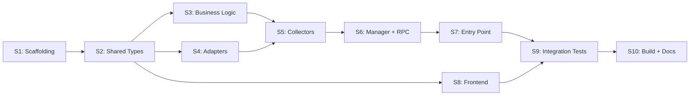

# podman-desktop-stats-plugin — Development Specification v1.0.0

**Version**: 1.0.0
**Date**: 2026-02-18
**Based on**: [ARCHITECTURE-1_0_0.md](ARCHITECTURE-1_0_0.md)
**JIRA**: N/A
**Methodology**: TDD (Red-Green-Refactor), Iterative-Incremental
**Target coverage**: > 80%

---

## 1. Development Principles

### 1.1 TDD Methodology

All code follows **RED → GREEN → REFACTOR**:

1. **RED**: Write failing tests that define the expected behavior
   - Tests are written BEFORE implementation code
   - Tests must fail for the right reason (not compilation errors where avoidable)
   - Test code is specified in this document with exact assertions

2. **GREEN**: Write the minimum code to make all tests pass
   - No gold-plating — only what's needed to pass the tests
   - No optimization in this phase

3. **REFACTOR**: Improve code quality while keeping tests green
   - Extract constants, remove duplication
   - Improve naming and documentation
   - Run full test suite after every refactor

### 1.2 Iterative-Incremental Development

Each sprint produces a **verifiable increment**:
- New tests pass
- All previous tests pass (regression protection)
- Coverage targets are met
- The increment can be demonstrated or measured

### 1.3 Dependencies Between Sprints



### 1.4 Version Requirements (mandatory)

| Dependency | Minimum Version | Verified Via |
|-----------|----------------|-------------|
| TypeScript | 5.x | Web search |
| Node.js | 20+ | Web search |
| Svelte | 5.x | Web search (PD uses Svelte 5) |
| Vite | 6.x | Web search |
| Vitest | 3.x | Web search |
| @podman-desktop/api | latest | Web search |
| @podman-desktop/ui-svelte | ^1.22.0 | Web search |
| TailwindCSS | 4.x | Web search |

### 1.5 Conventions

| Convention | Rule |
|-----------|------|
| Language | All code, comments, and docs in English |
| Test files | `*.test.ts` co-located in `__tests__/` directories |
| Test functions | `describe('ComponentName', () => { it('should ...') })` |
| Constants | `SCREAMING_SNAKE_CASE` |
| File naming | `kebab-case.ts` |
| Imports | Named imports preferred; type-only imports with `import type` |

---

## 2. Completeness Map

| # | Component | ARCH Section | Sprint | Files | Tests | Status |
|---|-----------|-------------|--------|-------|-------|--------|
| C01 | Root package.json (workspaces) | 14 | S1 | `package.json` | N/A (config) | ✅ Done |
| C02 | tsconfig.base.json | 14 | S1 | `tsconfig.base.json` | N/A (config) | ✅ Done |
| C03 | Shared package.json + tsconfig | 14 | S1 | `packages/shared/package.json`, `packages/shared/tsconfig.json` | N/A (config) | ✅ Done |
| C04 | Backend package.json + tsconfig + vite.config | 11, 12, 14 | S1 | `packages/backend/package.json`, `packages/backend/tsconfig.json`, `packages/backend/vite.config.ts` | N/A (config) | ✅ Done |
| C05 | Frontend package.json + configs | 14 | S1 | `packages/frontend/package.json`, `packages/frontend/tsconfig.json`, `packages/frontend/vite.config.ts`, `packages/frontend/svelte.config.js`, `packages/frontend/tailwind.config.js` | N/A (config) | ✅ Done |
| C06 | vitest.config.ts | 15 | S1 | `vitest.config.ts` | N/A (config) | ✅ Done |
| C07 | .eslintrc.json + .prettierrc | 14 | S1 | `.eslintrc.json`, `.prettierrc` | N/A (config) | ✅ Done |
| C08 | .gitignore | 14 | S1 | `.gitignore` | N/A (config) | ✅ Done |
| C09 | PD API mock | 15.2 | S1 | `__mocks__/@podman-desktop/api.ts` | N/A (test infra) | ✅ Done |
| C10 | ProcessedContainerStats | 5.1 | S2 | `packages/shared/src/types.ts` | `packages/shared/src/__tests__/types.test.ts` | ✅ Done |
| C11 | HostStats | 5.2 | S2 | `packages/shared/src/types.ts` | (same as C10) | ✅ Done |
| C12 | StatsSnapshot | 5.3 | S2 | `packages/shared/src/types.ts` | (same as C10) | ✅ Done |
| C13 | RpcMessage / RpcCommand | 5.4 | S2 | `packages/shared/src/rpc-types.ts` | (same as C10) | ✅ Done |
| C14 | CpuTimes | 5.5 | S2 | `packages/shared/src/types.ts` | (same as C10) | ✅ Done |
| C15 | formatBytes | 6.6 | S2 | `packages/shared/src/format.ts` | `packages/shared/src/__tests__/format.test.ts` | ✅ Done |
| C16 | formatPercent | 6.6 | S2 | `packages/shared/src/format.ts` | (same as C15) | ✅ Done |
| C17 | formatUptime | 6.6 | S2 | `packages/shared/src/format.ts` | (same as C15) | ✅ Done |
| C18 | Shared index.ts | 14 | S2 | `packages/shared/src/index.ts` | N/A | ✅ Done |
| C19 | Mock stats fixtures | 15.2 | S3 | `packages/backend/src/__tests__/fixtures.ts` | N/A (test infra) | ✅ Done |
| C20 | computeCpuPercent | 6.1 | S3 | `packages/backend/src/stats-calculator.ts` | `packages/backend/src/__tests__/stats-calculator.test.ts` | ✅ Done |
| C21 | computeMemoryUsage | 6.2 | S3 | `packages/backend/src/stats-calculator.ts` | (same as C20) | ✅ Done |
| C22 | computeNetworkIO | 6.3 | S3 | `packages/backend/src/stats-calculator.ts` | (same as C20) | ✅ Done |
| C23 | computeBlockIO | 6.4 | S3 | `packages/backend/src/stats-calculator.ts` | (same as C20) | ✅ Done |
| C24 | computeContainerStats | 6.5 | S3 | `packages/backend/src/stats-calculator.ts` | (same as C20) | ✅ Done |
| C25 | ContainerEnginePort interface | 7.1, 20.1 | S4 | `packages/backend/src/adapters/container-engine-adapter.ts` | N/A (interface) | ✅ Done |
| C26 | PodmanDesktopContainerEngine | 7.1 | S4 | `packages/backend/src/adapters/container-engine-adapter.ts` | `packages/backend/src/__tests__/container-engine-adapter.test.ts` | ✅ Done |
| C27 | OsPort interface | 7.2, 20.2 | S4 | `packages/backend/src/adapters/os-adapter.ts` | N/A (interface) | ✅ Done |
| C28 | NodeOsAdapter | 7.2 | S4 | `packages/backend/src/adapters/os-adapter.ts` | `packages/backend/src/__tests__/os-adapter.test.ts` | ✅ Done |
| C29 | Logger | 9.2 | S4 | `packages/backend/src/logger.ts` | `packages/backend/src/__tests__/logger.test.ts` | ✅ Done |
| C30 | HostStatsCollector | 4.4 | S5 | `packages/backend/src/host-stats-collector.ts` | `packages/backend/src/__tests__/host-stats-collector.test.ts` | ✅ Done |
| C31 | ContainerStatsCollector | 4.3 | S5 | `packages/backend/src/container-stats-collector.ts` | `packages/backend/src/__tests__/container-stats-collector.test.ts` | ✅ Done |
| C32 | ConfigManager | 4.5 | S5 | `packages/backend/src/config-manager.ts` | `packages/backend/src/__tests__/config-manager.test.ts` | ✅ Done |
| C33 | StatsListener interface | 4.2, 20.3 | S6 | `packages/backend/src/stats-manager.ts` | N/A (interface) | ✅ Done |
| C34 | StatsManager | 4.2 | S6 | `packages/backend/src/stats-manager.ts` | `packages/backend/src/__tests__/stats-manager.test.ts` | ✅ Done |
| C35 | RpcBridge | 4.6 | S6 | `packages/backend/src/rpc-bridge.ts` | `packages/backend/src/__tests__/rpc-bridge.test.ts` | ✅ Done |
| C36 | extension.ts (activate/deactivate) | 4.1 | S7 | `packages/backend/src/extension.ts` | `packages/backend/src/__tests__/extension.test.ts` | ✅ Done |
| C37 | stats-store.ts (Svelte store) | 8.3 | S8 | `packages/frontend/src/stores/stats-store.ts` | `packages/frontend/src/__tests__/stats-store.test.ts` | Pending |
| C38 | App.svelte | 14 | S8 | `packages/frontend/src/App.svelte` | N/A (root mount) | Pending |
| C39 | Dashboard.svelte | 19.3 | S8 | `packages/frontend/src/Dashboard.svelte` | `packages/frontend/src/__tests__/Dashboard.test.ts` | Pending |
| C40 | HostOverview.svelte | 19.2 | S8 | `packages/frontend/src/components/HostOverview.svelte` | `packages/frontend/src/__tests__/HostOverview.test.ts` | Pending |
| C41 | ContainerTable.svelte | 19.2 | S8 | `packages/frontend/src/components/ContainerTable.svelte` | `packages/frontend/src/__tests__/ContainerTable.test.ts` | Pending |
| C42 | ContainerRow.svelte | 19.2 | S8 | `packages/frontend/src/components/ContainerRow.svelte` | `packages/frontend/src/__tests__/ContainerRow.test.ts` | Pending |
| C43 | StatsBar.svelte | 19.2 | S8 | `packages/frontend/src/components/StatsBar.svelte` | `packages/frontend/src/__tests__/StatsBar.test.ts` | Pending |
| C44 | SettingsBar.svelte | 19.2 | S8 | `packages/frontend/src/components/SettingsBar.svelte` | `packages/frontend/src/__tests__/SettingsBar.test.ts` | Pending |
| C45 | Frontend index.html | 14 | S8 | `packages/frontend/index.html` | N/A | Pending |
| C46 | Integration tests | 15 | S9 | `packages/backend/src/__tests__/integration.test.ts` | (self) | Pending |
| C47 | README.md | 9 | S10 | `README.md` | N/A (doc) | Pending |
| C48 | CLAUDE.md | 9 | S10 | `CLAUDE.md` | N/A (doc) | Pending |
| C49 | CHANGELOG.md | 9 | S10 | `CHANGELOG.md` | N/A (doc) | Pending |
| C50 | GitHub Actions CI | 11 | S10 | `.github/workflows/ci.yml` | N/A (CI config) | Pending |

**Total**: 50 components

---

## 3. Sprint Plan

### General Overview

| Sprint | Name | Components | New Tests | Verifiable Increment |
|--------|------|-----------|-----------|---------------------|
| S1 | Scaffolding | C01-C09 (9) | Compilation check | Project structure, configs, npm install succeeds, TypeScript compiles |
| S2 | Shared Types + Formatters | C10-C18 (9) | ~15 unit tests | Type definitions compile, formatter functions pass all tests |
| S3 | Business Logic (Stats Calculator) | C19-C24 (6) | ~20 unit tests | All stats calculation functions pass edge case tests |
| S4 | Adapters + Logger | C25-C29 (5) | ~8 unit tests | Port interfaces defined, adapters tested |
| S5 | Collectors + Config | C30-C32 (3) | ~15 unit tests | Host and container collectors tested with mock adapters |
| S6 | Manager + RPC Bridge | C33-C35 (3) | ~12 unit tests | Stats orchestration and RPC messaging tested |
| S7 | Extension Entry Point | C36 (1) | ~5 unit tests | activate/deactivate lifecycle tested |
| S8 | Frontend Components | C37-C45 (9) | ~12 unit tests | Svelte components render with test data |
| S9 | Integration Tests | C46 (1) | ~8 integration tests | Full backend pipeline tested end-to-end |
| S10 | Build, CI/CD + Docs | C47-C50 (4) | N/A | `npm run build` succeeds, CI pipeline defined, docs complete |

---

## 4. Sprint 1: Scaffolding

### Objective

Initialize the project structure with npm workspaces, TypeScript configurations, build tooling, and test infrastructure. After this sprint, `npm install` and `npm run typecheck` succeed across all packages.

### Architecture Ref.

- ARCHITECTURE-1_0_0.md Section 14 (Project Structure)
- ARCHITECTURE-1_0_0.md Section 11 (Deployment / Build)
- ARCHITECTURE-1_0_0.md Section 15 (Testing Strategy)

### Components: C01-C09

| # | Component | Description | File | Tests |
|---|-----------|-------------|------|-------|
| C01 | Root package.json | npm workspaces config | `package.json` | N/A |
| C02 | tsconfig.base.json | Shared TS compiler options | `tsconfig.base.json` | N/A |
| C03 | Shared package config | shared package.json + tsconfig | `packages/shared/package.json`, `packages/shared/tsconfig.json` | N/A |
| C04 | Backend package config | Extension manifest + TS + Vite | `packages/backend/package.json`, `packages/backend/tsconfig.json`, `packages/backend/vite.config.ts` | N/A |
| C05 | Frontend package config | Svelte + Tailwind + Vite | `packages/frontend/package.json`, `packages/frontend/tsconfig.json`, `packages/frontend/vite.config.ts`, `packages/frontend/svelte.config.js`, `packages/frontend/tailwind.config.js` | N/A |
| C06 | vitest.config.ts | Vitest workspace config | `vitest.config.ts` | N/A |
| C07 | Linting + Formatting | ESLint + Prettier configs | `.eslintrc.json`, `.prettierrc` | N/A |
| C08 | .gitignore | Git ignore rules | `.gitignore` | N/A |
| C09 | PD API mock | Mock @podman-desktop/api for tests | `__mocks__/@podman-desktop/api.ts` | N/A |

### Implementation (No TDD — Configuration Sprint)

#### T1.1: Create root package.json with workspaces

**File:** `package.json`

```json
{
  "name": "podman-desktop-stats-plugin",
  "private": true,
  "version": "1.0.0",
  "workspaces": [
    "packages/shared",
    "packages/backend",
    "packages/frontend"
  ],
  "scripts": {
    "build": "npm run build --workspaces",
    "watch": "npm run watch --workspaces",
    "test": "vitest run",
    "test:watch": "vitest",
    "test:coverage": "vitest run --coverage",
    "typecheck": "npm run typecheck --workspaces",
    "lint": "eslint . --ext .ts,.svelte",
    "format": "prettier --write ."
  },
  "devDependencies": {
    "@typescript-eslint/eslint-plugin": "^8.0.0",
    "@typescript-eslint/parser": "^8.0.0",
    "eslint": "^9.0.0",
    "prettier": "^3.0.0",
    "typescript": "^5.7.0",
    "vitest": "^3.0.0",
    "@vitest/coverage-v8": "^3.0.0"
  }
}
```

#### T1.2: Create tsconfig.base.json

**File:** `tsconfig.base.json`

```json
{
  "compilerOptions": {
    "target": "ES2022",
    "module": "ESNext",
    "moduleResolution": "bundler",
    "lib": ["ES2022"],
    "strict": true,
    "esModuleInterop": true,
    "skipLibCheck": true,
    "forceConsistentCasingInFileNames": true,
    "resolveJsonModule": true,
    "isolatedModules": true,
    "declaration": true,
    "declarationMap": true,
    "sourceMap": true
  }
}
```

#### T1.3: Create shared package

Create `packages/shared/package.json`, `packages/shared/tsconfig.json`, and stub `packages/shared/src/index.ts`.

#### T1.4: Create backend package

Create `packages/backend/package.json` (with PD extension manifest fields), `packages/backend/tsconfig.json`, `packages/backend/vite.config.ts`.

#### T1.5: Create frontend package

Create `packages/frontend/package.json`, `packages/frontend/tsconfig.json`, `packages/frontend/vite.config.ts`, `packages/frontend/svelte.config.js`, `packages/frontend/tailwind.config.js`.

#### T1.6: Create vitest.config.ts

**File:** `vitest.config.ts`

```typescript
import { defineConfig } from 'vitest/config';

export default defineConfig({
  test: {
    globals: true,
    coverage: {
      provider: 'v8',
      reporter: ['text', 'html', 'lcov'],
      include: [
        'packages/shared/src/**/*.ts',
        'packages/backend/src/**/*.ts',
      ],
      exclude: [
        '**/__tests__/**',
        '**/__mocks__/**',
        '**/index.ts',
      ],
    },
  },
});
```

#### T1.7: Create linting + formatting configs

Create `.eslintrc.json` and `.prettierrc`.

#### T1.8: Create .gitignore

```
node_modules/
dist/
packages/backend/media/
coverage/
*.tgz
.DS_Store
```

#### T1.9: Create PD API mock

**File:** `__mocks__/@podman-desktop/api.ts`

```typescript
// __mocks__/@podman-desktop/api.ts
// Mock implementation of @podman-desktop/api for unit testing

import { vi } from 'vitest';

export const containerEngine = {
  listContainers: vi.fn().mockResolvedValue([]),
  statsContainer: vi.fn().mockResolvedValue({ dispose: vi.fn() }),
  info: vi.fn().mockResolvedValue({}),
};

export const window = {
  createWebviewPanel: vi.fn().mockReturnValue({
    webview: {
      postMessage: vi.fn(),
      onDidReceiveMessage: vi.fn().mockReturnValue({ dispose: vi.fn() }),
    },
    onDidChangeViewState: vi.fn().mockReturnValue({ dispose: vi.fn() }),
    visible: true,
    dispose: vi.fn(),
  }),
  showInformationMessage: vi.fn(),
};

export const configuration = {
  getConfiguration: vi.fn().mockReturnValue({
    get: vi.fn().mockReturnValue(3),
  }),
  onDidChangeConfiguration: vi.fn().mockReturnValue({ dispose: vi.fn() }),
};

export const StatusBarAlignLeft = 1;

export type Disposable = { dispose(): void };
export type ExtensionContext = {
  subscriptions: Disposable[];
  storagePath: string;
};
```

### Sprint 1 Acceptance Criteria

- [x] `npm install` completes without errors
- [x] Directory structure matches ARCHITECTURE-1_0_0.md Section 14
- [x] `npx tsc --noEmit -p packages/shared/tsconfig.json` succeeds
- [x] `npx tsc --noEmit -p packages/backend/tsconfig.json` succeeds (after stubs)
- [x] `__mocks__/@podman-desktop/api.ts` exists and exports required mocks
- [x] `.gitignore` excludes `node_modules/`, `dist/`, `packages/backend/media/`

---

## 5. Sprint 2: Shared Types + Formatters

### Objective

Define all shared type interfaces and implement formatting utilities. These types form the contract between backend and frontend. After this sprint, all type definitions compile and all formatter tests pass.

### Architecture Ref.

- ARCHITECTURE-1_0_0.md Section 5 (Data Structures)
- ARCHITECTURE-1_0_0.md Section 6.6 (Byte Formatting Utility)

### Components: C10-C18

| # | Component | Description | File | Tests |
|---|-----------|-------------|------|-------|
| C10 | ProcessedContainerStats | Container stats interface | `packages/shared/src/types.ts` | `packages/shared/src/__tests__/types.test.ts` |
| C11 | HostStats | Host system stats interface | `packages/shared/src/types.ts` | (same) |
| C12 | StatsSnapshot | Combined snapshot interface | `packages/shared/src/types.ts` | (same) |
| C13 | RpcMessage / RpcCommand | RPC message types | `packages/shared/src/rpc-types.ts` | (same) |
| C14 | CpuTimes | CPU delta helper type | `packages/shared/src/types.ts` | (same) |
| C15 | formatBytes | Byte formatting function | `packages/shared/src/format.ts` | `packages/shared/src/__tests__/format.test.ts` |
| C16 | formatPercent | Percentage formatting | `packages/shared/src/format.ts` | (same) |
| C17 | formatUptime | Uptime formatting | `packages/shared/src/format.ts` | (same) |
| C18 | Shared index.ts | Public re-exports | `packages/shared/src/index.ts` | N/A |

### Tests FIRST (TDD)

#### T2.1: Tests for type definitions (compile-time verification)

**File:** `packages/shared/src/__tests__/types.test.ts`

```typescript
// packages/shared/src/__tests__/types.test.ts
import { describe, it, expect } from 'vitest';
import type {
  ProcessedContainerStats,
  HostStats,
  StatsSnapshot,
  CpuTimes,
} from '../types';
import type { RpcMessage, RpcCommand } from '../rpc-types';

describe('Type definitions', () => {
  it('should create a valid ProcessedContainerStats object', () => {
    const stats: ProcessedContainerStats = {
      id: 'abc123',
      name: 'my-container',
      image: 'nginx:latest',
      state: 'running',
      engineId: 'podman',
      cpuUsagePercent: 25.5,
      memoryUsed: 268435456,
      memoryLimit: 536870912,
      memoryUsagePercent: 50.0,
      networkRx: 1024,
      networkTx: 2048,
      blockRead: 4096,
      blockWrite: 8192,
      pids: 12,
      timestamp: Date.now(),
    };
    expect(stats.id).toBe('abc123');
    expect(stats.cpuUsagePercent).toBe(25.5);
  });

  it('should create a valid HostStats object', () => {
    const host: HostStats = {
      cpuUsagePercent: 45.2,
      cpuCount: 8,
      memoryTotal: 17179869184,
      memoryUsed: 8589934592,
      memoryFree: 8589934592,
      memoryUsagePercent: 50.0,
      uptime: 86400,
      platform: 'linux',
      hostname: 'dev-machine',
    };
    expect(host.cpuCount).toBe(8);
    expect(host.platform).toBe('linux');
  });

  it('should create a valid StatsSnapshot object', () => {
    const snapshot: StatsSnapshot = {
      timestamp: Date.now(),
      containers: [],
      host: {
        cpuUsagePercent: 0,
        cpuCount: 1,
        memoryTotal: 1024,
        memoryUsed: 512,
        memoryFree: 512,
        memoryUsagePercent: 50,
        uptime: 100,
        platform: 'linux',
        hostname: 'test',
      },
    };
    expect(snapshot.containers).toEqual([]);
    expect(snapshot.host.cpuCount).toBe(1);
  });

  it('should create valid RPC message types', () => {
    const msg: RpcMessage = {
      type: 'stats-update',
      payload: {
        timestamp: Date.now(),
        containers: [],
        host: {
          cpuUsagePercent: 0,
          cpuCount: 1,
          memoryTotal: 1024,
          memoryUsed: 512,
          memoryFree: 512,
          memoryUsagePercent: 50,
          uptime: 100,
          platform: 'linux',
          hostname: 'test',
        },
      },
    };
    expect(msg.type).toBe('stats-update');

    const cmd: RpcCommand = { type: 'request-refresh' };
    expect(cmd.type).toBe('request-refresh');
  });

  it('should create a valid CpuTimes object', () => {
    const times: CpuTimes = { idle: 1000, total: 5000 };
    expect(times.idle).toBe(1000);
    expect(times.total).toBe(5000);
  });
});
```

**Verification:** Tests fail (RED) — types not yet defined

#### T2.2: Tests for formatBytes

**File:** `packages/shared/src/__tests__/format.test.ts`

```typescript
// packages/shared/src/__tests__/format.test.ts
import { describe, it, expect } from 'vitest';
import { formatBytes, formatPercent, formatUptime } from '../format';

describe('formatBytes', () => {
  it('should format 0 bytes', () => {
    expect(formatBytes(0)).toBe('0 B');
  });

  it('should format bytes (< 1 KB)', () => {
    expect(formatBytes(500)).toBe('500.0 B');
  });

  it('should format kilobytes', () => {
    expect(formatBytes(1024)).toBe('1.0 KB');
    expect(formatBytes(1536)).toBe('1.5 KB');
  });

  it('should format megabytes', () => {
    expect(formatBytes(1048576)).toBe('1.0 MB');
    expect(formatBytes(268435456)).toBe('256.0 MB');
  });

  it('should format gigabytes', () => {
    expect(formatBytes(1073741824)).toBe('1.0 GB');
    expect(formatBytes(17179869184)).toBe('16.0 GB');
  });

  it('should format terabytes', () => {
    expect(formatBytes(1099511627776)).toBe('1.0 TB');
  });

  it('should handle negative values', () => {
    expect(formatBytes(-1024)).toBe('-1.0 KB');
  });

  it('should respect decimals parameter', () => {
    expect(formatBytes(1536, 2)).toBe('1.50 KB');
    expect(formatBytes(1536, 0)).toBe('2 KB');
  });
});

describe('formatPercent', () => {
  it('should format percentage with default 1 decimal', () => {
    expect(formatPercent(45.23)).toBe('45.2%');
  });

  it('should format 0%', () => {
    expect(formatPercent(0)).toBe('0.0%');
  });

  it('should format 100%', () => {
    expect(formatPercent(100)).toBe('100.0%');
  });

  it('should handle values > 100%', () => {
    expect(formatPercent(150.7)).toBe('150.7%');
  });

  it('should respect decimals parameter', () => {
    expect(formatPercent(45.236, 2)).toBe('45.24%');
    expect(formatPercent(45.236, 0)).toBe('45%');
  });
});

describe('formatUptime', () => {
  it('should format minutes only', () => {
    expect(formatUptime(300)).toBe('5m');
    expect(formatUptime(59)).toBe('0m');
  });

  it('should format hours and minutes', () => {
    expect(formatUptime(3600)).toBe('1h 0m');
    expect(formatUptime(5400)).toBe('1h 30m');
  });

  it('should format days and hours', () => {
    expect(formatUptime(86400)).toBe('1d 0h');
    expect(formatUptime(90000)).toBe('1d 1h');
    expect(formatUptime(302400)).toBe('3d 12h');
  });

  it('should handle 0 seconds', () => {
    expect(formatUptime(0)).toBe('0m');
  });
});
```

**Verification:** Tests fail (RED) — format functions not yet implemented

#### T2.3: Implement type definitions

**File:** `packages/shared/src/types.ts`

Implement all interfaces as specified in ARCHITECTURE-1_0_0.md Section 5:
- `ProcessedContainerStats`
- `HostStats`
- `StatsSnapshot`
- `CpuTimes`

**File:** `packages/shared/src/rpc-types.ts`

Implement:
- `RpcMessage`
- `RpcCommand`

**Verification:** Type tests pass (GREEN)

#### T2.4: Implement format utilities

**File:** `packages/shared/src/format.ts`

Implement `formatBytes`, `formatPercent`, `formatUptime` as specified in ARCHITECTURE-1_0_0.md Section 6.6.

**File:** `packages/shared/src/index.ts`

Re-export all types and format functions.

**Verification:** All format tests pass (GREEN)

### Sprint 2 Acceptance Criteria

- [x] `npx vitest run packages/shared` — all 15+ tests pass
- [x] Type definitions compile without errors
- [x] `packages/shared/src/index.ts` exports all public types and functions
- [x] Coverage > 95% for `packages/shared/src/format.ts`
- [x] All existing tests still pass (regression)

---

## 6. Sprint 3: Business Logic (Stats Calculator)

### Objective

Implement the pure business logic for computing container statistics from raw `ContainerStatsInfo` data. These are pure functions with no framework dependencies, making them easy to test exhaustively. After this sprint, all stats calculation functions pass comprehensive edge-case tests.

### Architecture Ref.

- ARCHITECTURE-1_0_0.md Section 6 (Business Logic Layer)
- ARCHITECTURE-1_0_0.md Section 15.3 (Test Conventions)

### Components: C19-C24

| # | Component | Description | File | Tests |
|---|-----------|-------------|------|-------|
| C19 | Mock stats fixtures | Test data factory | `packages/backend/src/__tests__/fixtures.ts` | N/A |
| C20 | computeCpuPercent | CPU usage percentage calc | `packages/backend/src/stats-calculator.ts` | `packages/backend/src/__tests__/stats-calculator.test.ts` |
| C21 | computeMemoryUsage | Memory usage calc | (same) | (same) |
| C22 | computeNetworkIO | Network I/O aggregation | (same) | (same) |
| C23 | computeBlockIO | Block I/O aggregation | (same) | (same) |
| C24 | computeContainerStats | Full stats assembly | (same) | (same) |

### Tests FIRST (TDD)

#### T3.1: Create mock fixtures

**File:** `packages/backend/src/__tests__/fixtures.ts`

```typescript
// packages/backend/src/__tests__/fixtures.ts

export interface MockCpuStats {
  cpu_usage: { total_usage: number };
  system_cpu_usage: number;
  online_cpus: number;
  throttling_data?: Record<string, unknown>;
}

export interface MockMemoryStats {
  usage: number;
  limit: number;
  stats?: Record<string, number>;
  max_usage?: number;
  failcnt?: number;
}

export interface MockBlkioEntry {
  op: string;
  value: number;
}

export interface MockStatsInfo {
  cpu_stats: MockCpuStats;
  precpu_stats: MockCpuStats;
  memory_stats: MockMemoryStats;
  networks?: Record<string, { rx_bytes?: number; tx_bytes?: number }>;
  blkio_stats?: {
    io_service_bytes_recursive?: MockBlkioEntry[];
  };
  pids_stats?: { current?: number };
  read?: string;
  preread?: string;
  num_procs?: number;
}

export function createMockStatsInfo(
  overrides: Partial<MockStatsInfo> = {},
): MockStatsInfo {
  return {
    cpu_stats: {
      cpu_usage: { total_usage: 200_000_000 },
      system_cpu_usage: 1_000_000_000,
      online_cpus: 4,
    },
    precpu_stats: {
      cpu_usage: { total_usage: 100_000_000 },
      system_cpu_usage: 500_000_000,
      online_cpus: 4,
    },
    memory_stats: {
      usage: 268435456,
      limit: 536870912,
    },
    networks: {
      eth0: { rx_bytes: 1024, tx_bytes: 2048 },
    },
    blkio_stats: {
      io_service_bytes_recursive: [
        { op: 'read', value: 4096 },
        { op: 'write', value: 8192 },
      ],
    },
    pids_stats: { current: 12 },
    ...overrides,
  };
}

export interface MockContainerInfo {
  Id: string;
  Names: string[];
  Image: string;
  State: string;
  engineId: string;
}

export function createMockContainerInfo(
  overrides: Partial<MockContainerInfo> = {},
): MockContainerInfo {
  return {
    Id: 'abc123def456',
    Names: ['my-container'],
    Image: 'nginx:latest',
    State: 'running',
    engineId: 'podman',
    ...overrides,
  };
}
```

#### T3.2: Tests for computeCpuPercent

**File:** `packages/backend/src/__tests__/stats-calculator.test.ts`

```typescript
// packages/backend/src/__tests__/stats-calculator.test.ts
import { describe, it, expect } from 'vitest';
import {
  computeCpuPercent,
  computeMemoryUsage,
  computeNetworkIO,
  computeBlockIO,
  computeContainerStats,
} from '../stats-calculator';
import { createMockStatsInfo, createMockContainerInfo } from './fixtures';

describe('computeCpuPercent', () => {
  it('should compute CPU percentage from deltas', () => {
    const stats = createMockStatsInfo({
      cpu_stats: {
        cpu_usage: { total_usage: 200_000_000 },
        system_cpu_usage: 1_000_000_000,
        online_cpus: 4,
      },
      precpu_stats: {
        cpu_usage: { total_usage: 100_000_000 },
        system_cpu_usage: 500_000_000,
        online_cpus: 4,
      },
    });
    // cpuDelta = 100M, sysDelta = 500M, (100M/500M)*4*100 = 80%
    expect(computeCpuPercent(stats)).toBeCloseTo(80.0);
  });

  it('should return 0 when system delta is 0 (first sample)', () => {
    const stats = createMockStatsInfo({
      cpu_stats: {
        cpu_usage: { total_usage: 100 },
        system_cpu_usage: 500,
        online_cpus: 1,
      },
      precpu_stats: {
        cpu_usage: { total_usage: 100 },
        system_cpu_usage: 500,
        online_cpus: 1,
      },
    });
    expect(computeCpuPercent(stats)).toBe(0);
  });

  it('should return 0 when cpu delta is negative (container restart)', () => {
    const stats = createMockStatsInfo({
      cpu_stats: {
        cpu_usage: { total_usage: 50 },
        system_cpu_usage: 1000,
        online_cpus: 1,
      },
      precpu_stats: {
        cpu_usage: { total_usage: 100 },
        system_cpu_usage: 500,
        online_cpus: 1,
      },
    });
    expect(computeCpuPercent(stats)).toBe(0);
  });

  it('should handle single CPU', () => {
    const stats = createMockStatsInfo({
      cpu_stats: {
        cpu_usage: { total_usage: 200 },
        system_cpu_usage: 1000,
        online_cpus: 1,
      },
      precpu_stats: {
        cpu_usage: { total_usage: 100 },
        system_cpu_usage: 500,
        online_cpus: 1,
      },
    });
    // (100/500)*1*100 = 20%
    expect(computeCpuPercent(stats)).toBeCloseTo(20.0);
  });

  it('should allow values > 100% for multi-core', () => {
    const stats = createMockStatsInfo({
      cpu_stats: {
        cpu_usage: { total_usage: 800 },
        system_cpu_usage: 1000,
        online_cpus: 8,
      },
      precpu_stats: {
        cpu_usage: { total_usage: 0 },
        system_cpu_usage: 0,
        online_cpus: 8,
      },
    });
    // (800/1000)*8*100 = 640%
    expect(computeCpuPercent(stats)).toBeCloseTo(640.0);
  });

  it('should default online_cpus to 1 when 0', () => {
    const stats = createMockStatsInfo({
      cpu_stats: {
        cpu_usage: { total_usage: 200 },
        system_cpu_usage: 1000,
        online_cpus: 0,
      },
      precpu_stats: {
        cpu_usage: { total_usage: 100 },
        system_cpu_usage: 500,
        online_cpus: 0,
      },
    });
    // (100/500)*1*100 = 20%
    expect(computeCpuPercent(stats)).toBeCloseTo(20.0);
  });
});

describe('computeMemoryUsage', () => {
  it('should compute memory usage percentage', () => {
    const stats = createMockStatsInfo({
      memory_stats: { usage: 268435456, limit: 536870912 },
    });
    const result = computeMemoryUsage(stats);
    expect(result.used).toBe(268435456);
    expect(result.limit).toBe(536870912);
    expect(result.percent).toBeCloseTo(50.0);
  });

  it('should return 0% when limit is 0 (unlimited)', () => {
    const stats = createMockStatsInfo({
      memory_stats: { usage: 268435456, limit: 0 },
    });
    const result = computeMemoryUsage(stats);
    expect(result.used).toBe(268435456);
    expect(result.limit).toBe(0);
    expect(result.percent).toBe(0);
  });

  it('should handle zero usage', () => {
    const stats = createMockStatsInfo({
      memory_stats: { usage: 0, limit: 536870912 },
    });
    const result = computeMemoryUsage(stats);
    expect(result.percent).toBe(0);
  });

  it('should handle undefined values as 0', () => {
    const stats = createMockStatsInfo({
      memory_stats: { usage: undefined as unknown as number, limit: undefined as unknown as number },
    });
    const result = computeMemoryUsage(stats);
    expect(result.used).toBe(0);
    expect(result.limit).toBe(0);
    expect(result.percent).toBe(0);
  });
});

describe('computeNetworkIO', () => {
  it('should sum rx and tx across interfaces', () => {
    const stats = createMockStatsInfo({
      networks: {
        eth0: { rx_bytes: 1000, tx_bytes: 2000 },
        eth1: { rx_bytes: 500, tx_bytes: 300 },
      },
    });
    const result = computeNetworkIO(stats);
    expect(result.rx).toBe(1500);
    expect(result.tx).toBe(2300);
  });

  it('should return 0 when networks is undefined', () => {
    const stats = createMockStatsInfo({ networks: undefined });
    const result = computeNetworkIO(stats);
    expect(result.rx).toBe(0);
    expect(result.tx).toBe(0);
  });

  it('should handle empty networks object', () => {
    const stats = createMockStatsInfo({ networks: {} });
    const result = computeNetworkIO(stats);
    expect(result.rx).toBe(0);
    expect(result.tx).toBe(0);
  });

  it('should handle missing rx_bytes or tx_bytes', () => {
    const stats = createMockStatsInfo({
      networks: {
        eth0: { rx_bytes: 100 } as { rx_bytes?: number; tx_bytes?: number },
      },
    });
    const result = computeNetworkIO(stats);
    expect(result.rx).toBe(100);
    expect(result.tx).toBe(0);
  });
});

describe('computeBlockIO', () => {
  it('should sum read and write operations', () => {
    const stats = createMockStatsInfo({
      blkio_stats: {
        io_service_bytes_recursive: [
          { op: 'read', value: 1000 },
          { op: 'write', value: 2000 },
          { op: 'read', value: 500 },
          { op: 'write', value: 300 },
        ],
      },
    });
    const result = computeBlockIO(stats);
    expect(result.read).toBe(1500);
    expect(result.write).toBe(2300);
  });

  it('should handle case-insensitive op names', () => {
    const stats = createMockStatsInfo({
      blkio_stats: {
        io_service_bytes_recursive: [
          { op: 'Read', value: 100 },
          { op: 'WRITE', value: 200 },
        ],
      },
    });
    const result = computeBlockIO(stats);
    expect(result.read).toBe(100);
    expect(result.write).toBe(200);
  });

  it('should return 0 when blkio_stats is undefined', () => {
    const stats = createMockStatsInfo({ blkio_stats: undefined });
    const result = computeBlockIO(stats);
    expect(result.read).toBe(0);
    expect(result.write).toBe(0);
  });

  it('should return 0 when io_service_bytes_recursive is undefined', () => {
    const stats = createMockStatsInfo({
      blkio_stats: { io_service_bytes_recursive: undefined },
    });
    const result = computeBlockIO(stats);
    expect(result.read).toBe(0);
    expect(result.write).toBe(0);
  });

  it('should ignore non-read/write ops', () => {
    const stats = createMockStatsInfo({
      blkio_stats: {
        io_service_bytes_recursive: [
          { op: 'read', value: 100 },
          { op: 'sync', value: 50 },
          { op: 'async', value: 25 },
          { op: 'write', value: 200 },
        ],
      },
    });
    const result = computeBlockIO(stats);
    expect(result.read).toBe(100);
    expect(result.write).toBe(200);
  });
});

describe('computeContainerStats', () => {
  it('should assemble all stats into ProcessedContainerStats', () => {
    const container = createMockContainerInfo();
    const stats = createMockStatsInfo();

    const result = computeContainerStats(container as any, stats as any, undefined);

    expect(result.id).toBe('abc123def456');
    expect(result.name).toBe('my-container');
    expect(result.image).toBe('nginx:latest');
    expect(result.state).toBe('running');
    expect(result.engineId).toBe('podman');
    expect(result.cpuUsagePercent).toBeCloseTo(80.0);
    expect(result.memoryUsed).toBe(268435456);
    expect(result.memoryLimit).toBe(536870912);
    expect(result.memoryUsagePercent).toBeCloseTo(50.0);
    expect(result.networkRx).toBe(1024);
    expect(result.networkTx).toBe(2048);
    expect(result.blockRead).toBe(4096);
    expect(result.blockWrite).toBe(8192);
    expect(result.pids).toBe(12);
    expect(result.timestamp).toBeGreaterThan(0);
  });

  it('should use truncated ID when Names is empty', () => {
    const container = createMockContainerInfo({ Names: [] });
    const stats = createMockStatsInfo();
    const result = computeContainerStats(container as any, stats as any, undefined);
    expect(result.name).toBe('abc123def456'.substring(0, 12));
  });

  it('should default pids to 0 when pids_stats missing', () => {
    const container = createMockContainerInfo();
    const stats = createMockStatsInfo({ pids_stats: undefined });
    const result = computeContainerStats(container as any, stats as any, undefined);
    expect(result.pids).toBe(0);
  });
});
```

**Verification:** Tests fail (RED) — stats-calculator.ts not yet implemented

#### T3.3: Implement stats calculator

**File:** `packages/backend/src/stats-calculator.ts`

Implement all functions as specified in ARCHITECTURE-1_0_0.md Section 6:
- `computeCpuPercent`
- `computeMemoryUsage`
- `computeNetworkIO`
- `computeBlockIO`
- `computeContainerStats`

**Verification:** All tests pass (GREEN)

### Sprint 3 Acceptance Criteria

- [x] `npx vitest run packages/backend/src/__tests__/stats-calculator.test.ts` — all ~20 tests pass
- [x] Coverage > 95% for `packages/backend/src/stats-calculator.ts`
- [x] All existing tests still pass (regression)

---

## 7. Sprint 4: Adapters + Logger

### Objective

Define the port interfaces and implement production adapters for the Podman Desktop container engine API and Node.js OS module. Implement the logger utility. After this sprint, the adapter layer provides testable abstractions over external dependencies.

### Architecture Ref.

- ARCHITECTURE-1_0_0.md Section 7 (Adapter Layer)
- ARCHITECTURE-1_0_0.md Section 9.2 (Logging Strategy)
- ARCHITECTURE-1_0_0.md Section 20 (API and Interface Contracts)

### Components: C25-C29

| # | Component | Description | File | Tests |
|---|-----------|-------------|------|-------|
| C25 | ContainerEnginePort | Port interface | `packages/backend/src/adapters/container-engine-adapter.ts` | N/A |
| C26 | PodmanDesktopContainerEngine | Production adapter | (same) | `packages/backend/src/__tests__/container-engine-adapter.test.ts` |
| C27 | OsPort | Port interface | `packages/backend/src/adapters/os-adapter.ts` | N/A |
| C28 | NodeOsAdapter | Production adapter | (same) | `packages/backend/src/__tests__/os-adapter.test.ts` |
| C29 | Logger | Logging utilities | `packages/backend/src/logger.ts` | `packages/backend/src/__tests__/logger.test.ts` |

### Tests FIRST (TDD)

#### T4.1: Tests for PodmanDesktopContainerEngine adapter

**File:** `packages/backend/src/__tests__/container-engine-adapter.test.ts`

```typescript
// packages/backend/src/__tests__/container-engine-adapter.test.ts
import { describe, it, expect, vi, beforeEach } from 'vitest';

vi.mock('@podman-desktop/api');

import { PodmanDesktopContainerEngine } from '../adapters/container-engine-adapter';
import { containerEngine } from '@podman-desktop/api';

describe('PodmanDesktopContainerEngine', () => {
  let adapter: PodmanDesktopContainerEngine;

  beforeEach(() => {
    vi.clearAllMocks();
    adapter = new PodmanDesktopContainerEngine();
  });

  it('should delegate listContainers to PD API', async () => {
    const mockContainers = [{ Id: 'abc', Names: ['test'], State: 'running' }];
    vi.mocked(containerEngine.listContainers).mockResolvedValue(mockContainers as any);

    const result = await adapter.listContainers();
    expect(containerEngine.listContainers).toHaveBeenCalledOnce();
    expect(result).toEqual(mockContainers);
  });

  it('should delegate statsContainer to PD API', async () => {
    const mockDisposable = { dispose: vi.fn() };
    vi.mocked(containerEngine.statsContainer).mockResolvedValue(mockDisposable);
    const callback = vi.fn();

    const result = await adapter.statsContainer('engine1', 'container1', callback);
    expect(containerEngine.statsContainer).toHaveBeenCalledWith('engine1', 'container1', callback);
    expect(result).toBe(mockDisposable);
  });
});
```

#### T4.2: Tests for NodeOsAdapter

**File:** `packages/backend/src/__tests__/os-adapter.test.ts`

```typescript
// packages/backend/src/__tests__/os-adapter.test.ts
import { describe, it, expect } from 'vitest';
import { NodeOsAdapter } from '../adapters/os-adapter';

describe('NodeOsAdapter', () => {
  const adapter = new NodeOsAdapter();

  it('should return CPU info array', () => {
    const cpus = adapter.cpus();
    expect(Array.isArray(cpus)).toBe(true);
    expect(cpus.length).toBeGreaterThan(0);
    expect(cpus[0]).toHaveProperty('times');
  });

  it('should return total memory > 0', () => {
    expect(adapter.totalmem()).toBeGreaterThan(0);
  });

  it('should return free memory > 0', () => {
    expect(adapter.freemem()).toBeGreaterThan(0);
  });

  it('should return uptime > 0', () => {
    expect(adapter.uptime()).toBeGreaterThan(0);
  });

  it('should return a valid platform string', () => {
    const platform = adapter.platform();
    expect(['linux', 'darwin', 'win32', 'freebsd']).toContain(platform);
  });

  it('should return a non-empty hostname', () => {
    expect(adapter.hostname().length).toBeGreaterThan(0);
  });
});
```

#### T4.3: Tests for Logger

**File:** `packages/backend/src/__tests__/logger.test.ts`

```typescript
// packages/backend/src/__tests__/logger.test.ts
import { describe, it, expect, vi, beforeEach } from 'vitest';
import { log, warn, error } from '../logger';

describe('Logger', () => {
  beforeEach(() => {
    vi.spyOn(console, 'log').mockImplementation(() => {});
    vi.spyOn(console, 'warn').mockImplementation(() => {});
    vi.spyOn(console, 'error').mockImplementation(() => {});
  });

  it('should log with [container-stats] prefix', () => {
    log('test message');
    expect(console.log).toHaveBeenCalledWith('[container-stats] test message');
  });

  it('should warn with [container-stats] prefix', () => {
    warn('warning message');
    expect(console.warn).toHaveBeenCalledWith('[container-stats] warning message');
  });

  it('should error with [container-stats] prefix', () => {
    error('error message');
    expect(console.error).toHaveBeenCalledWith('[container-stats] error message');
  });

  it('should pass additional args', () => {
    log('test', 'arg1', 42);
    expect(console.log).toHaveBeenCalledWith('[container-stats] test', 'arg1', 42);
  });
});
```

**Verification:** Tests fail (RED)

#### T4.4: Implement adapters and logger

Implement as specified in ARCHITECTURE-1_0_0.md Section 7 and 9.2.

**Verification:** All tests pass (GREEN)

### Sprint 4 Acceptance Criteria

- [x] `npx vitest run packages/backend/src/__tests__/container-engine-adapter.test.ts` — all pass
- [x] `npx vitest run packages/backend/src/__tests__/os-adapter.test.ts` — all pass
- [x] `npx vitest run packages/backend/src/__tests__/logger.test.ts` — all pass
- [x] Coverage > 80% for adapter files
- [x] All existing tests still pass (regression)

---

## 8. Sprint 5: Collectors + ConfigManager

### Objective

Implement HostStatsCollector, ContainerStatsCollector, and ConfigManager using the adapter ports for testability. After this sprint, collectors correctly aggregate stats data when given mock adapters.

### Architecture Ref.

- ARCHITECTURE-1_0_0.md Section 4.3 (ContainerStatsCollector)
- ARCHITECTURE-1_0_0.md Section 4.4 (HostStatsCollector)
- ARCHITECTURE-1_0_0.md Section 4.5 (ConfigManager)
- ARCHITECTURE-1_0_0.md Section 12 (Configuration)

### Components: C30-C32

| # | Component | Description | File | Tests |
|---|-----------|-------------|------|-------|
| C30 | HostStatsCollector | Host CPU/memory collector | `packages/backend/src/host-stats-collector.ts` | `packages/backend/src/__tests__/host-stats-collector.test.ts` |
| C31 | ContainerStatsCollector | Per-container stats manager | `packages/backend/src/container-stats-collector.ts` | `packages/backend/src/__tests__/container-stats-collector.test.ts` |
| C32 | ConfigManager | Extension settings reader | `packages/backend/src/config-manager.ts` | `packages/backend/src/__tests__/config-manager.test.ts` |

### Tests FIRST (TDD)

#### T5.1: Tests for HostStatsCollector

**File:** `packages/backend/src/__tests__/host-stats-collector.test.ts`

```typescript
// packages/backend/src/__tests__/host-stats-collector.test.ts
import { describe, it, expect, vi } from 'vitest';
import { HostStatsCollector } from '../host-stats-collector';
import type { OsPort } from '../adapters/os-adapter';

function createMockOsAdapter(overrides: Partial<OsPort> = {}): OsPort {
  return {
    cpus: vi.fn().mockReturnValue([
      { model: 'cpu', speed: 2400, times: { user: 100, nice: 0, sys: 50, idle: 800, irq: 50 } },
      { model: 'cpu', speed: 2400, times: { user: 100, nice: 0, sys: 50, idle: 800, irq: 50 } },
    ]),
    totalmem: vi.fn().mockReturnValue(17179869184),
    freemem: vi.fn().mockReturnValue(8589934592),
    uptime: vi.fn().mockReturnValue(86400),
    platform: vi.fn().mockReturnValue('linux' as NodeJS.Platform),
    hostname: vi.fn().mockReturnValue('test-host'),
    ...overrides,
  };
}

describe('HostStatsCollector', () => {
  it('should return host stats on first collect (CPU = 0 on first call)', () => {
    const osAdapter = createMockOsAdapter();
    const collector = new HostStatsCollector(osAdapter);

    const stats = collector.collect();

    expect(stats.cpuUsagePercent).toBe(0); // First sample, no delta
    expect(stats.cpuCount).toBe(2);
    expect(stats.memoryTotal).toBe(17179869184);
    expect(stats.memoryUsed).toBe(17179869184 - 8589934592);
    expect(stats.memoryFree).toBe(8589934592);
    expect(stats.memoryUsagePercent).toBeCloseTo(50.0);
    expect(stats.uptime).toBe(86400);
    expect(stats.platform).toBe('linux');
    expect(stats.hostname).toBe('test-host');
  });

  it('should compute CPU delta on second collect', () => {
    const firstCpus = [
      { model: 'cpu', speed: 2400, times: { user: 100, nice: 0, sys: 50, idle: 800, irq: 50 } },
    ];
    const secondCpus = [
      { model: 'cpu', speed: 2400, times: { user: 200, nice: 0, sys: 100, idle: 900, irq: 50 } },
    ];

    const osAdapter = createMockOsAdapter({
      cpus: vi.fn()
        .mockReturnValueOnce(firstCpus) // first collect
        .mockReturnValueOnce(secondCpus) // second collect
        .mockReturnValueOnce(secondCpus), // cpuCount read
    });

    const collector = new HostStatsCollector(osAdapter);

    collector.collect(); // First call — sets baseline

    const stats = collector.collect(); // Second call — computes delta
    // First: idle=800, total=1000
    // Second: idle=900, total=1250
    // idleDelta=100, totalDelta=250
    // usage = (250-100)/250 * 100 = 60%
    expect(stats.cpuUsagePercent).toBeCloseTo(60.0);
  });

  it('should return 0% CPU when total delta is 0', () => {
    const sameCpus = [
      { model: 'cpu', speed: 2400, times: { user: 100, nice: 0, sys: 50, idle: 800, irq: 50 } },
    ];

    const osAdapter = createMockOsAdapter({
      cpus: vi.fn().mockReturnValue(sameCpus),
    });

    const collector = new HostStatsCollector(osAdapter);
    collector.collect(); // baseline
    const stats = collector.collect(); // same values
    expect(stats.cpuUsagePercent).toBe(0);
  });
});
```

#### T5.2: Tests for ContainerStatsCollector

**File:** `packages/backend/src/__tests__/container-stats-collector.test.ts`

```typescript
// packages/backend/src/__tests__/container-stats-collector.test.ts
import { describe, it, expect, vi, beforeEach } from 'vitest';
import { ContainerStatsCollector } from '../container-stats-collector';
import type { ContainerEnginePort } from '../adapters/container-engine-adapter';
import { createMockContainerInfo, createMockStatsInfo } from './fixtures';

function createMockEngine(): ContainerEnginePort {
  return {
    listContainers: vi.fn().mockResolvedValue([]),
    statsContainer: vi.fn().mockResolvedValue({ dispose: vi.fn() }),
  };
}

describe('ContainerStatsCollector', () => {
  let engine: ReturnType<typeof createMockEngine>;
  let collector: ContainerStatsCollector;

  beforeEach(() => {
    engine = createMockEngine();
    collector = new ContainerStatsCollector(engine);
  });

  it('should return empty stats when no containers running', async () => {
    await collector.startStreams();
    expect(collector.getLatestStats()).toEqual([]);
  });

  it('should subscribe to running containers', async () => {
    const containers = [
      createMockContainerInfo({ Id: 'c1', State: 'running' }),
      createMockContainerInfo({ Id: 'c2', State: 'running' }),
      createMockContainerInfo({ Id: 'c3', State: 'exited' }),
    ];
    vi.mocked(engine.listContainers).mockResolvedValue(containers as any);

    await collector.startStreams();

    // Should only subscribe to running containers (c1, c2)
    expect(engine.statsContainer).toHaveBeenCalledTimes(2);
  });

  it('should update stats map when callback fires', async () => {
    const container = createMockContainerInfo({ Id: 'c1', State: 'running' });
    vi.mocked(engine.listContainers).mockResolvedValue([container as any]);

    let capturedCallback: ((stats: any) => void) | undefined;
    vi.mocked(engine.statsContainer).mockImplementation(
      async (_engineId, _containerId, callback) => {
        capturedCallback = callback;
        return { dispose: vi.fn() };
      },
    );

    await collector.startStreams();

    // Simulate a stats callback
    const mockStats = createMockStatsInfo();
    capturedCallback!(mockStats);

    const latest = collector.getLatestStats();
    expect(latest).toHaveLength(1);
    expect(latest[0].id).toBe('c1');
  });

  it('should dispose all streams on stopStreams', async () => {
    const container = createMockContainerInfo({ Id: 'c1', State: 'running' });
    vi.mocked(engine.listContainers).mockResolvedValue([container as any]);
    const disposeFn = vi.fn();
    vi.mocked(engine.statsContainer).mockResolvedValue({ dispose: disposeFn });

    await collector.startStreams();
    collector.stopStreams();

    expect(disposeFn).toHaveBeenCalledOnce();
    expect(collector.getLatestStats()).toEqual([]);
  });

  it('should handle statsContainer errors gracefully', async () => {
    const container = createMockContainerInfo({ Id: 'c1', State: 'running' });
    vi.mocked(engine.listContainers).mockResolvedValue([container as any]);
    vi.mocked(engine.statsContainer).mockRejectedValue(new Error('container gone'));

    // Should not throw
    await expect(collector.startStreams()).resolves.not.toThrow();
  });

  it('should refresh container list and clean up removed containers', async () => {
    const c1 = createMockContainerInfo({ Id: 'c1', State: 'running' });
    const c2 = createMockContainerInfo({ Id: 'c2', State: 'running' });
    const disposeFn1 = vi.fn();
    const disposeFn2 = vi.fn();

    vi.mocked(engine.listContainers).mockResolvedValueOnce([c1, c2] as any);
    vi.mocked(engine.statsContainer)
      .mockResolvedValueOnce({ dispose: disposeFn1 })
      .mockResolvedValueOnce({ dispose: disposeFn2 });

    await collector.startStreams();

    // Now c2 is gone
    vi.mocked(engine.listContainers).mockResolvedValueOnce([c1] as any);
    await collector.refreshContainerList();

    expect(disposeFn2).toHaveBeenCalledOnce();
    expect(disposeFn1).not.toHaveBeenCalled();
  });
});
```

#### T5.3: Tests for ConfigManager

**File:** `packages/backend/src/__tests__/config-manager.test.ts`

```typescript
// packages/backend/src/__tests__/config-manager.test.ts
import { describe, it, expect, vi, beforeEach } from 'vitest';

vi.mock('@podman-desktop/api');

import { ConfigManager } from '../config-manager';
import { configuration } from '@podman-desktop/api';

describe('ConfigManager', () => {
  let configManager: ConfigManager;
  const mockContext = { subscriptions: [], storagePath: '/tmp' } as any;

  beforeEach(() => {
    vi.clearAllMocks();
    configManager = new ConfigManager(mockContext);
  });

  it('should return default interval (3000ms) when not configured', () => {
    vi.mocked(configuration.getConfiguration).mockReturnValue({
      get: vi.fn().mockReturnValue(undefined),
    } as any);

    expect(configManager.getRefreshIntervalMs()).toBe(3000);
  });

  it('should return configured interval in milliseconds', () => {
    vi.mocked(configuration.getConfiguration).mockReturnValue({
      get: vi.fn().mockReturnValue(5),
    } as any);

    expect(configManager.getRefreshIntervalMs()).toBe(5000);
  });

  it('should clamp interval to minimum (1s)', () => {
    vi.mocked(configuration.getConfiguration).mockReturnValue({
      get: vi.fn().mockReturnValue(0),
    } as any);

    expect(configManager.getRefreshIntervalMs()).toBe(1000);
  });

  it('should clamp interval to maximum (30s)', () => {
    vi.mocked(configuration.getConfiguration).mockReturnValue({
      get: vi.fn().mockReturnValue(60),
    } as any);

    expect(configManager.getRefreshIntervalMs()).toBe(30000);
  });

  it('should return interval in seconds', () => {
    vi.mocked(configuration.getConfiguration).mockReturnValue({
      get: vi.fn().mockReturnValue(5),
    } as any);

    expect(configManager.getRefreshIntervalSeconds()).toBe(5);
  });

  it('should register configuration change listener', () => {
    const callback = vi.fn();
    configManager.onDidChangeConfiguration(callback);
    expect(configuration.onDidChangeConfiguration).toHaveBeenCalledOnce();
  });
});
```

**Verification:** Tests fail (RED)

#### T5.4: Implement collectors and config manager

Implement as specified in ARCHITECTURE-1_0_0.md Sections 4.3, 4.4, 4.5.

**Important**: `HostStatsCollector` and `ContainerStatsCollector` must accept their adapter ports via constructor injection for testability.

**Verification:** All tests pass (GREEN)

### Sprint 5 Acceptance Criteria

- [x] `npx vitest run packages/backend/src/__tests__/host-stats-collector.test.ts` — all pass
- [x] `npx vitest run packages/backend/src/__tests__/container-stats-collector.test.ts` — all pass
- [x] `npx vitest run packages/backend/src/__tests__/config-manager.test.ts` — all pass
- [x] Coverage > 80% for all three files
- [x] All existing tests still pass (regression)

---

## 9. Sprint 6: StatsManager + RPC Bridge

### Objective

Implement the orchestration layer (StatsManager) and the RPC bridge for backend-frontend communication. After this sprint, the full backend pipeline is assembled and tested.

### Architecture Ref.

- ARCHITECTURE-1_0_0.md Section 4.2 (StatsManager)
- ARCHITECTURE-1_0_0.md Section 4.6 (RpcBridge)
- ARCHITECTURE-1_0_0.md Section 8 (Shared State Management)

### Components: C33-C35

| # | Component | Description | File | Tests |
|---|-----------|-------------|------|-------|
| C33 | StatsListener interface | Listener contract | `packages/backend/src/stats-manager.ts` | N/A |
| C34 | StatsManager | Orchestrates collection | `packages/backend/src/stats-manager.ts` | `packages/backend/src/__tests__/stats-manager.test.ts` |
| C35 | RpcBridge | Backend↔Frontend messaging | `packages/backend/src/rpc-bridge.ts` | `packages/backend/src/__tests__/rpc-bridge.test.ts` |

### Tests FIRST (TDD)

#### T6.1: Tests for StatsManager

**File:** `packages/backend/src/__tests__/stats-manager.test.ts`

```typescript
// packages/backend/src/__tests__/stats-manager.test.ts
import { describe, it, expect, vi, beforeEach, afterEach } from 'vitest';
import { StatsManager, StatsListener } from '../stats-manager';

// Create mock dependencies
function createMockDeps() {
  const mockContainerCollector = {
    startStreams: vi.fn().mockResolvedValue(undefined),
    stopStreams: vi.fn(),
    getLatestStats: vi.fn().mockReturnValue([]),
    refreshContainerList: vi.fn().mockResolvedValue(undefined),
  };
  const mockHostCollector = {
    collect: vi.fn().mockReturnValue({
      cpuUsagePercent: 25,
      cpuCount: 4,
      memoryTotal: 16000,
      memoryUsed: 8000,
      memoryFree: 8000,
      memoryUsagePercent: 50,
      uptime: 1000,
      platform: 'linux',
      hostname: 'test',
    }),
  };
  const mockConfigManager = {
    getRefreshIntervalMs: vi.fn().mockReturnValue(1000),
    getRefreshIntervalSeconds: vi.fn().mockReturnValue(1),
    onDidChangeConfiguration: vi.fn().mockReturnValue({ dispose: vi.fn() }),
  };
  const mockListener: StatsListener = {
    onStatsUpdate: vi.fn(),
  };

  return { mockContainerCollector, mockHostCollector, mockConfigManager, mockListener };
}

describe('StatsManager', () => {
  beforeEach(() => {
    vi.useFakeTimers();
  });

  afterEach(() => {
    vi.useRealTimers();
  });

  it('should start collection and emit snapshot immediately', async () => {
    const deps = createMockDeps();
    const manager = new StatsManager(
      deps.mockConfigManager as any,
      deps.mockContainerCollector as any,
      deps.mockHostCollector as any,
    );
    manager.setListener(deps.mockListener);

    await manager.start();

    expect(deps.mockContainerCollector.startStreams).toHaveBeenCalledOnce();
    expect(deps.mockListener.onStatsUpdate).toHaveBeenCalledOnce();
    const snapshot = vi.mocked(deps.mockListener.onStatsUpdate).mock.calls[0][0];
    expect(snapshot.timestamp).toBeGreaterThan(0);
    expect(snapshot.containers).toEqual([]);
    expect(snapshot.host.cpuUsagePercent).toBe(25);

    manager.stop();
  });

  it('should emit snapshots on interval', async () => {
    const deps = createMockDeps();
    const manager = new StatsManager(
      deps.mockConfigManager as any,
      deps.mockContainerCollector as any,
      deps.mockHostCollector as any,
    );
    manager.setListener(deps.mockListener);

    await manager.start();
    expect(deps.mockListener.onStatsUpdate).toHaveBeenCalledTimes(1);

    vi.advanceTimersByTime(1000);
    expect(deps.mockListener.onStatsUpdate).toHaveBeenCalledTimes(2);

    vi.advanceTimersByTime(1000);
    expect(deps.mockListener.onStatsUpdate).toHaveBeenCalledTimes(3);

    manager.stop();
  });

  it('should stop collection and clear interval', async () => {
    const deps = createMockDeps();
    const manager = new StatsManager(
      deps.mockConfigManager as any,
      deps.mockContainerCollector as any,
      deps.mockHostCollector as any,
    );

    await manager.start();
    manager.stop();

    expect(deps.mockContainerCollector.stopStreams).toHaveBeenCalledOnce();

    // Advancing time should NOT trigger more emissions
    const callCount = vi.mocked(deps.mockListener.onStatsUpdate).mock.calls.length;
    vi.advanceTimersByTime(5000);
    expect(deps.mockListener.onStatsUpdate).toHaveBeenCalledTimes(callCount);
  });

  it('should not double-start', async () => {
    const deps = createMockDeps();
    const manager = new StatsManager(
      deps.mockConfigManager as any,
      deps.mockContainerCollector as any,
      deps.mockHostCollector as any,
    );

    await manager.start();
    await manager.start(); // second call should be no-op

    expect(deps.mockContainerCollector.startStreams).toHaveBeenCalledTimes(1);

    manager.stop();
  });

  it('should not double-stop', () => {
    const deps = createMockDeps();
    const manager = new StatsManager(
      deps.mockConfigManager as any,
      deps.mockContainerCollector as any,
      deps.mockHostCollector as any,
    );

    manager.stop(); // not started yet — no-op
    expect(deps.mockContainerCollector.stopStreams).not.toHaveBeenCalled();
  });
});
```

#### T6.2: Tests for RpcBridge

**File:** `packages/backend/src/__tests__/rpc-bridge.test.ts`

```typescript
// packages/backend/src/__tests__/rpc-bridge.test.ts
import { describe, it, expect, vi, beforeEach } from 'vitest';
import { RpcBridge } from '../rpc-bridge';
import type { StatsSnapshot } from '@podman-desktop-stats/shared';

describe('RpcBridge', () => {
  let mockWebview: any;
  let mockStatsManager: any;
  let bridge: RpcBridge;

  beforeEach(() => {
    mockWebview = {
      postMessage: vi.fn(),
      onDidReceiveMessage: vi.fn().mockReturnValue({ dispose: vi.fn() }),
    };
    mockStatsManager = {
      setListener: vi.fn(),
      emitSnapshot: vi.fn(),
    };
    bridge = new RpcBridge(mockWebview, mockStatsManager);
  });

  it('should register itself as listener on StatsManager', () => {
    expect(mockStatsManager.setListener).toHaveBeenCalledWith(bridge);
  });

  it('should post message to webview on stats update', () => {
    const snapshot: StatsSnapshot = {
      timestamp: 1000,
      containers: [],
      host: {
        cpuUsagePercent: 10,
        cpuCount: 2,
        memoryTotal: 8000,
        memoryUsed: 4000,
        memoryFree: 4000,
        memoryUsagePercent: 50,
        uptime: 100,
        platform: 'linux',
        hostname: 'test',
      },
    };

    bridge.onStatsUpdate(snapshot);

    expect(mockWebview.postMessage).toHaveBeenCalledWith({
      type: 'stats-update',
      payload: snapshot,
    });
  });

  it('should register message listener on webview', () => {
    expect(mockWebview.onDidReceiveMessage).toHaveBeenCalledOnce();
  });

  it('should handle request-refresh command', () => {
    // Capture the message handler
    const handler = vi.mocked(mockWebview.onDidReceiveMessage).mock.calls[0][0];
    handler({ type: 'request-refresh' });

    expect(mockStatsManager.emitSnapshot).toHaveBeenCalledOnce();
  });

  it('should dispose webview listener on dispose', () => {
    const mockDispose = vi.fn();
    mockWebview.onDidReceiveMessage.mockReturnValue({ dispose: mockDispose });

    const newBridge = new RpcBridge(mockWebview, mockStatsManager);
    newBridge.dispose();

    expect(mockDispose).toHaveBeenCalledOnce();
  });
});
```

**Verification:** Tests fail (RED)

#### T6.3: Implement StatsManager and RpcBridge

Implement as specified in ARCHITECTURE-1_0_0.md Sections 4.2 and 4.6.

**Important**: `StatsManager` constructor must accept collectors and config manager via DI.

**Verification:** All tests pass (GREEN)

### Sprint 6 Acceptance Criteria

- [x] `npx vitest run packages/backend/src/__tests__/stats-manager.test.ts` — all pass
- [x] `npx vitest run packages/backend/src/__tests__/rpc-bridge.test.ts` — all pass
- [x] Coverage > 80% for `stats-manager.ts` and `rpc-bridge.ts`
- [x] All existing tests still pass (regression)

---

## 10. Sprint 7: Extension Entry Point

### Objective

Wire everything together in `extension.ts` with the `activate()` and `deactivate()` lifecycle functions. After this sprint, the extension can be loaded (in mock context) and its lifecycle is tested.

### Architecture Ref.

- ARCHITECTURE-1_0_0.md Section 4.1 (Extension Entry Point)

### Components: C36

| # | Component | Description | File | Tests |
|---|-----------|-------------|------|-------|
| C36 | extension.ts | activate/deactivate lifecycle | `packages/backend/src/extension.ts` | `packages/backend/src/__tests__/extension.test.ts` |

### Tests FIRST (TDD)

#### T7.1: Tests for extension lifecycle

**File:** `packages/backend/src/__tests__/extension.test.ts`

```typescript
// packages/backend/src/__tests__/extension.test.ts
import { describe, it, expect, vi, beforeEach } from 'vitest';

vi.mock('@podman-desktop/api');

import { activate, deactivate } from '../extension';
import { window } from '@podman-desktop/api';

describe('Extension lifecycle', () => {
  let mockContext: any;

  beforeEach(() => {
    vi.clearAllMocks();
    mockContext = {
      subscriptions: [],
      storagePath: '/tmp/test',
    };
  });

  it('should activate without errors', async () => {
    await expect(activate(mockContext)).resolves.not.toThrow();
  });

  it('should create a webview panel', async () => {
    await activate(mockContext);
    expect(window.createWebviewPanel).toHaveBeenCalledWith(
      'container-stats',
      'Container Stats',
      expect.any(Object),
    );
  });

  it('should push disposables to subscriptions', async () => {
    await activate(mockContext);
    expect(mockContext.subscriptions.length).toBeGreaterThan(0);
  });

  it('should deactivate without errors', async () => {
    await activate(mockContext);
    await expect(deactivate()).resolves.not.toThrow();
  });

  it('should handle deactivate without prior activate', async () => {
    await expect(deactivate()).resolves.not.toThrow();
  });
});
```

**Verification:** Tests fail (RED)

#### T7.2: Implement extension.ts

Implement as specified in ARCHITECTURE-1_0_0.md Section 4.1.

**Verification:** All tests pass (GREEN)

### Sprint 7 Acceptance Criteria

- [x] `npx vitest run packages/backend/src/__tests__/extension.test.ts` — all pass
- [x] `npm run build --workspace=packages/backend` succeeds (or `npx tsc --noEmit`)
- [x] All existing tests still pass (regression)

---

## 11. Sprint 8: Frontend Components

### Objective

Implement the Svelte frontend: stats store, dashboard layout, and all display components. After this sprint, the frontend renders correctly with test data.

### Architecture Ref.

- ARCHITECTURE-1_0_0.md Section 8.3 (Frontend Svelte Store)
- ARCHITECTURE-1_0_0.md Section 19 (Dashboard Specification)

### Components: C37-C45

| # | Component | Description | File | Tests |
|---|-----------|-------------|------|-------|
| C37 | stats-store.ts | Svelte writable store | `packages/frontend/src/stores/stats-store.ts` | `packages/frontend/src/__tests__/stats-store.test.ts` |
| C38 | App.svelte | Root mount | `packages/frontend/src/App.svelte` | N/A |
| C39 | Dashboard.svelte | Main layout | `packages/frontend/src/Dashboard.svelte` | `packages/frontend/src/__tests__/Dashboard.test.ts` |
| C40 | HostOverview.svelte | Host stats panel | `packages/frontend/src/components/HostOverview.svelte` | `packages/frontend/src/__tests__/HostOverview.test.ts` |
| C41 | ContainerTable.svelte | Container table | `packages/frontend/src/components/ContainerTable.svelte` | `packages/frontend/src/__tests__/ContainerTable.test.ts` |
| C42 | ContainerRow.svelte | Single container row | `packages/frontend/src/components/ContainerRow.svelte` | `packages/frontend/src/__tests__/ContainerRow.test.ts` |
| C43 | StatsBar.svelte | Progress bar widget | `packages/frontend/src/components/StatsBar.svelte` | `packages/frontend/src/__tests__/StatsBar.test.ts` |
| C44 | SettingsBar.svelte | Refresh interval display | `packages/frontend/src/components/SettingsBar.svelte` | `packages/frontend/src/__tests__/SettingsBar.test.ts` |
| C45 | index.html | Frontend entry | `packages/frontend/index.html` | N/A |

### Tests FIRST (TDD)

#### T8.1: Tests for stats-store

**File:** `packages/frontend/src/__tests__/stats-store.test.ts`

```typescript
// packages/frontend/src/__tests__/stats-store.test.ts
import { describe, it, expect, vi } from 'vitest';
import { statsSnapshot, initStatsListener } from '../stores/stats-store';
import { get } from 'svelte/store';

describe('statsSnapshot store', () => {
  it('should initialize as undefined', () => {
    expect(get(statsSnapshot)).toBeUndefined();
  });

  it('should update when stats-update message received', () => {
    initStatsListener();

    const mockSnapshot = {
      timestamp: 1000,
      containers: [],
      host: {
        cpuUsagePercent: 10,
        cpuCount: 2,
        memoryTotal: 8000,
        memoryUsed: 4000,
        memoryFree: 4000,
        memoryUsagePercent: 50,
        uptime: 100,
        platform: 'linux',
        hostname: 'test',
      },
    };

    window.dispatchEvent(
      new MessageEvent('message', {
        data: { type: 'stats-update', payload: mockSnapshot },
      }),
    );

    expect(get(statsSnapshot)).toEqual(mockSnapshot);
  });

  it('should ignore non-stats-update messages', () => {
    initStatsListener();
    statsSnapshot.set(undefined);

    window.dispatchEvent(
      new MessageEvent('message', {
        data: { type: 'other-message', payload: {} },
      }),
    );

    expect(get(statsSnapshot)).toBeUndefined();
  });
});
```

#### T8.2: Tests for StatsBar component

**File:** `packages/frontend/src/__tests__/StatsBar.test.ts`

```typescript
// packages/frontend/src/__tests__/StatsBar.test.ts
import { describe, it, expect } from 'vitest';
import { render } from '@testing-library/svelte';
import StatsBar from '../components/StatsBar.svelte';

describe('StatsBar', () => {
  it('should render with given percentage', () => {
    const { container } = render(StatsBar, { props: { value: 75, max: 100 } });
    const bar = container.querySelector('[role="progressbar"]');
    expect(bar).toBeTruthy();
  });

  it('should clamp value to max', () => {
    const { container } = render(StatsBar, { props: { value: 150, max: 100 } });
    expect(container).toBeTruthy();
  });
});
```

#### T8.3: Tests for HostOverview component

**File:** `packages/frontend/src/__tests__/HostOverview.test.ts`

```typescript
// packages/frontend/src/__tests__/HostOverview.test.ts
import { describe, it, expect } from 'vitest';
import { render, screen } from '@testing-library/svelte';
import HostOverview from '../components/HostOverview.svelte';

describe('HostOverview', () => {
  const mockHostStats = {
    cpuUsagePercent: 45.2,
    cpuCount: 8,
    memoryTotal: 17179869184,
    memoryUsed: 8589934592,
    memoryFree: 8589934592,
    memoryUsagePercent: 50.0,
    uptime: 302400,
    platform: 'linux',
    hostname: 'dev-machine',
  };

  it('should display CPU usage', () => {
    render(HostOverview, { props: { stats: mockHostStats } });
    expect(screen.getByText(/45\.2%/)).toBeTruthy();
  });

  it('should display CPU count', () => {
    render(HostOverview, { props: { stats: mockHostStats } });
    expect(screen.getByText(/8/)).toBeTruthy();
  });

  it('should display uptime', () => {
    render(HostOverview, { props: { stats: mockHostStats } });
    expect(screen.getByText(/3d 12h/)).toBeTruthy();
  });
});
```

#### T8.4: Tests for ContainerTable component

**File:** `packages/frontend/src/__tests__/ContainerTable.test.ts`

```typescript
// packages/frontend/src/__tests__/ContainerTable.test.ts
import { describe, it, expect } from 'vitest';
import { render, screen } from '@testing-library/svelte';
import ContainerTable from '../components/ContainerTable.svelte';

describe('ContainerTable', () => {
  it('should show empty state when no containers', () => {
    render(ContainerTable, { props: { containers: [] } });
    expect(screen.getByText(/no running containers/i)).toBeTruthy();
  });

  it('should render rows for each container', () => {
    const containers = [
      {
        id: 'c1', name: 'web-app', image: 'nginx', state: 'running',
        engineId: 'podman', cpuUsagePercent: 12.5, memoryUsed: 268435456,
        memoryLimit: 536870912, memoryUsagePercent: 50, networkRx: 1024,
        networkTx: 2048, blockRead: 4096, blockWrite: 8192, pids: 42,
        timestamp: Date.now(),
      },
    ];
    render(ContainerTable, { props: { containers } });
    expect(screen.getByText('web-app')).toBeTruthy();
  });
});
```

**Verification:** Tests fail (RED)

#### T8.5: Implement all frontend components

Implement Svelte components and store as specified in ARCHITECTURE-1_0_0.md Sections 8.3 and 19.

**Verification:** All tests pass (GREEN)

### Sprint 8 Acceptance Criteria

- [ ] `npx vitest run packages/frontend` — all tests pass
- [ ] `npm run build --workspace=packages/frontend` succeeds
- [ ] Coverage > 80% for `stores/stats-store.ts`
- [ ] All existing tests still pass (regression)

---

## 12. Sprint 9: Integration Tests

### Objective

Write integration tests that verify the full backend pipeline: container collector → stats manager → RPC bridge → message output. After this sprint, the entire backend data flow is verified end-to-end with mock PD API.

### Architecture Ref.

- ARCHITECTURE-1_0_0.md Section 15 (Testing Strategy)
- ARCHITECTURE-1_0_0.md Section 8 (Shared State Management)

### Components: C46

| # | Component | Description | File | Tests |
|---|-----------|-------------|------|-------|
| C46 | Integration tests | End-to-end backend pipeline | `packages/backend/src/__tests__/integration.test.ts` | (self) |

### Tests

#### T9.1: Integration test — full pipeline

**File:** `packages/backend/src/__tests__/integration.test.ts`

```typescript
// packages/backend/src/__tests__/integration.test.ts
import { describe, it, expect, vi, beforeEach, afterEach } from 'vitest';
import { StatsManager } from '../stats-manager';
import { ContainerStatsCollector } from '../container-stats-collector';
import { HostStatsCollector } from '../host-stats-collector';
import { RpcBridge } from '../rpc-bridge';
import { createMockContainerInfo, createMockStatsInfo } from './fixtures';
import type { ContainerEnginePort } from '../adapters/container-engine-adapter';
import type { OsPort } from '../adapters/os-adapter';
import type { StatsSnapshot } from '@podman-desktop-stats/shared';

describe('Integration: Full backend pipeline', () => {
  beforeEach(() => {
    vi.useFakeTimers();
  });

  afterEach(() => {
    vi.useRealTimers();
  });

  it('should collect stats from container engine and deliver via RPC', async () => {
    // Setup mock engine with one running container
    const container = createMockContainerInfo({ Id: 'int-c1', Names: ['test-app'], State: 'running' });
    let capturedCallback: ((stats: any) => void) | undefined;

    const mockEngine: ContainerEnginePort = {
      listContainers: vi.fn().mockResolvedValue([container]),
      statsContainer: vi.fn().mockImplementation(async (_e, _c, cb) => {
        capturedCallback = cb;
        return { dispose: vi.fn() };
      }),
    };

    // Setup mock OS adapter
    const mockOs: OsPort = {
      cpus: vi.fn().mockReturnValue([
        { model: 'cpu', speed: 2400, times: { user: 100, nice: 0, sys: 50, idle: 800, irq: 50 } },
      ]),
      totalmem: vi.fn().mockReturnValue(16000000000),
      freemem: vi.fn().mockReturnValue(8000000000),
      uptime: vi.fn().mockReturnValue(3600),
      platform: vi.fn().mockReturnValue('linux' as NodeJS.Platform),
      hostname: vi.fn().mockReturnValue('integration-test'),
    };

    // Setup config
    const mockConfig = {
      getRefreshIntervalMs: vi.fn().mockReturnValue(1000),
      getRefreshIntervalSeconds: vi.fn().mockReturnValue(1),
      onDidChangeConfiguration: vi.fn().mockReturnValue({ dispose: vi.fn() }),
    };

    // Setup webview mock
    const receivedMessages: any[] = [];
    const mockWebview = {
      postMessage: vi.fn().mockImplementation((msg: any) => receivedMessages.push(msg)),
      onDidReceiveMessage: vi.fn().mockReturnValue({ dispose: vi.fn() }),
    };

    // Wire up
    const containerCollector = new ContainerStatsCollector(mockEngine);
    const hostCollector = new HostStatsCollector(mockOs);
    const manager = new StatsManager(mockConfig as any, containerCollector, hostCollector);
    const _bridge = new RpcBridge(mockWebview, manager);

    // Start collection
    await manager.start();

    // Simulate a stats callback from the engine
    const mockStats = createMockStatsInfo();
    capturedCallback!(mockStats);

    // Advance timer to trigger snapshot emission
    vi.advanceTimersByTime(1000);

    // Verify messages received
    expect(receivedMessages.length).toBeGreaterThanOrEqual(1);
    const lastMsg = receivedMessages[receivedMessages.length - 1];
    expect(lastMsg.type).toBe('stats-update');

    const snapshot: StatsSnapshot = lastMsg.payload;
    expect(snapshot.containers.length).toBe(1);
    expect(snapshot.containers[0].name).toBe('test-app');
    expect(snapshot.host.hostname).toBe('integration-test');

    manager.stop();
  });

  it('should handle container disappearing between polls', async () => {
    const container = createMockContainerInfo({ Id: 'gone-c1', State: 'running' });

    const mockEngine: ContainerEnginePort = {
      listContainers: vi.fn()
        .mockResolvedValueOnce([container]) // first list
        .mockResolvedValueOnce([]),          // second list (container gone)
      statsContainer: vi.fn().mockResolvedValue({ dispose: vi.fn() }),
    };

    const mockOs: OsPort = {
      cpus: vi.fn().mockReturnValue([
        { model: 'cpu', speed: 2400, times: { user: 0, nice: 0, sys: 0, idle: 1000, irq: 0 } },
      ]),
      totalmem: vi.fn().mockReturnValue(8000),
      freemem: vi.fn().mockReturnValue(4000),
      uptime: vi.fn().mockReturnValue(100),
      platform: vi.fn().mockReturnValue('linux' as NodeJS.Platform),
      hostname: vi.fn().mockReturnValue('test'),
    };

    const mockConfig = {
      getRefreshIntervalMs: vi.fn().mockReturnValue(1000),
      getRefreshIntervalSeconds: vi.fn().mockReturnValue(1),
      onDidChangeConfiguration: vi.fn().mockReturnValue({ dispose: vi.fn() }),
    };

    const containerCollector = new ContainerStatsCollector(mockEngine);
    const hostCollector = new HostStatsCollector(mockOs);
    const manager = new StatsManager(mockConfig as any, containerCollector, hostCollector);

    await manager.start();
    await containerCollector.refreshContainerList();

    // Should not throw, container cleaned up
    expect(containerCollector.getLatestStats()).toEqual([]);

    manager.stop();
  });
});
```

### Sprint 9 Acceptance Criteria

- [ ] `npx vitest run packages/backend/src/__tests__/integration.test.ts` — all pass
- [ ] Full backend pipeline verified: engine → collector → manager → RPC → message
- [ ] Graceful container removal verified
- [ ] All existing tests still pass (regression)

---

## 13. Sprint 10: Build, CI/CD + Documentation

### Objective

Ensure the full project builds end-to-end, set up CI/CD pipeline, and create project documentation. After this sprint, `npm run build` produces a loadable PD extension and all docs are complete.

### Architecture Ref.

- ARCHITECTURE-1_0_0.md Section 11 (Deployment)
- ARCHITECTURE-1_0_0.md Section 14 (Project Structure)

### Components: C47-C50

| # | Component | Description | File | Tests |
|---|-----------|-------------|------|-------|
| C47 | README.md | Project documentation | `README.md` | N/A |
| C48 | CLAUDE.md | AI agent instructions | `CLAUDE.md` | N/A |
| C49 | CHANGELOG.md | Version history | `CHANGELOG.md` | N/A |
| C50 | GitHub Actions CI | CI/CD pipeline | `.github/workflows/ci.yml` | N/A |

### Implementation

#### T10.1: Verify full build

```bash
npm run build
```

This should:
1. Compile `packages/shared` → JS
2. Compile `packages/frontend` → static assets in `packages/backend/media/`
3. Compile `packages/backend` → `packages/backend/dist/extension.js`

#### T10.2: Create README.md

Include: project overview, installation, development setup, testing, building, loading in PD.

#### T10.3: Create CLAUDE.md

Include: project context, architecture overview, key commands, testing instructions.

#### T10.4: Create CHANGELOG.md

Document v1.0.0 features.

#### T10.5: Create GitHub Actions CI

**File:** `.github/workflows/ci.yml`

```yaml
name: CI
on:
  push:
    branches: [main]
  pull_request:
    branches: [main]

jobs:
  build-and-test:
    runs-on: ubuntu-latest
    steps:
      - uses: actions/checkout@v4
      - uses: actions/setup-node@v4
        with:
          node-version: '20'
      - run: npm install
      - run: npm run typecheck
      - run: npm run lint
      - run: npm run test -- --coverage
      - run: npm run build
```

### Sprint 10 Acceptance Criteria

- [ ] `npm run build` succeeds across all workspaces
- [ ] `npm run test` — all tests pass
- [ ] `npm run test -- --coverage` shows > 80% global coverage
- [ ] `npm run lint` passes
- [ ] `README.md` exists with install/build/test instructions
- [ ] `CLAUDE.md` exists with project context
- [ ] `CHANGELOG.md` exists with v1.0.0 entry
- [ ] `.github/workflows/ci.yml` exists
- [ ] All existing tests still pass (regression)

---

## 14. Completeness Map (Tracking)

### Combined Completeness

| Version | Components | Completed | Pending |
|---------|-----------|-----------|---------|
| v1.0.0 | 50 (C01-C50) | 9 | 41 |
| **Total** | **50** | **9** | **41** |

---

## 15. Global Acceptance Criteria

### Test Coverage

| Package/Module | Target | Measurement |
|---------------|--------|-------------|
| `packages/shared/src/format.ts` | > 95% | `npx vitest run --coverage` |
| `packages/backend/src/stats-calculator.ts` | > 95% | (same) |
| `packages/backend/src/` (all) | > 80% | (same) |
| `packages/frontend/src/stores/` | > 80% | (same) |
| **Global** | **> 80%** | `npm run test -- --coverage` |

### Functional Requirements

| ID | Requirement | Verification Sprint |
|----|------------|---------------------|
| R1-01 | Per-container CPU usage displayed | S8 (frontend), S3 (calc) |
| R1-02 | Per-container memory usage displayed | S8 (frontend), S3 (calc) |
| R1-03 | Per-container network I/O displayed | S8 (frontend), S3 (calc) |
| R1-04 | Per-container block I/O displayed | S8 (frontend), S3 (calc) |
| R1-05 | Host CPU, memory overview displayed | S8 (frontend), S5 (collector) |
| R1-06 | Dedicated dashboard page | S7 (entry), S8 (frontend) |
| R1-07 | Configurable refresh interval | S5 (config), S12 (package.json) |
| R1-08 | Podman 4.x and 5.x support | S4 (adapter via PD API) |

### Non-Functional Requirements

| Requirement | Target | Notes |
|------------|--------|-------|
| Extension activation | < 500ms | No heavy init in activate() |
| Idle CPU overhead | < 1% | No polling when dashboard hidden |
| Memory overhead (50 containers) | < 20MB backend | In-memory map only |

### Version Checklist

**v1.0.0:**
- [ ] All tests pass
- [ ] `npm run lint` passes
- [ ] `npm run build` compiles
- [ ] `npm audit` finds 0 high/critical issues
- [ ] Coverage targets met (> 80% global)
- [ ] All documentation in English
- [ ] CLAUDE.md updated
- [ ] README.md updated
- [ ] CHANGELOG.md has v1.0.0 entry

### Security Checklist

- [ ] No elevated privileges required (rootless Podman support)
- [ ] Read-only access to Podman API (no mutations)
- [ ] No external network calls
- [ ] No secrets or credentials stored
- [ ] No filesystem writes
- [ ] `npm audit` passes

---

## 16. Traceability Matrix

### Architecture Decisions

| AD | Description | Implemented in | Verified in |
|----|------------|----------------|-------------|
| AD-1 | Multi-package extension | S1 | S10 (build) |
| AD-2 | PD Extension API for stats | S4, S5 | S9 (integration) |
| AD-3 | Node.js os module for host stats | S4, S5 | S5 (unit), S9 (integration) |
| AD-4 | Svelte 5 with ui-svelte | S1, S8 | S8 (component tests) |
| AD-5 | Configurable polling interval | S5, S6 | S6 (unit), S9 (integration) |
| AD-6 | Svelte stores + in-memory maps | S5, S8 | S8 (store tests), S9 (integration) |

### Requirements → Components

| Requirement | Components |
|------------|-----------|
| R1-01 (CPU) | C20, C24, C31, C41, C42 |
| R1-02 (Memory) | C21, C24, C31, C41, C42 |
| R1-03 (Network I/O) | C22, C24, C31, C41, C42 |
| R1-04 (Block I/O) | C23, C24, C31, C41, C42 |
| R1-05 (Host stats) | C30, C40 |
| R1-06 (Dashboard) | C36, C38, C39 |
| R1-07 (Config) | C32, C04 |
| R1-08 (Podman compat) | C25, C26 |

### Components → Sprint

| Sprint | Components |
|--------|-----------|
| S1 | C01-C09 (9) |
| S2 | C10-C18 (9) |
| S3 | C19-C24 (6) |
| S4 | C25-C29 (5) |
| S5 | C30-C32 (3) |
| S6 | C33-C35 (3) |
| S7 | C36 (1) |
| S8 | C37-C45 (9) |
| S9 | C46 (1) |
| S10 | C47-C50 (4) |

### Data Flow per Component

```
C25/C26 (ContainerEnginePort/Adapter)
  └──> C31 (ContainerStatsCollector)
         └──> C20-C24 (stats-calculator functions)
                └──> C34 (StatsManager)
                       └──> C35 (RpcBridge)
                              └──> C37 (stats-store)
                                     └──> C39-C44 (Svelte components)

C27/C28 (OsPort/Adapter)
  └──> C30 (HostStatsCollector)
         └──> C34 (StatsManager) → (same flow as above)

C32 (ConfigManager)
  └──> C34 (StatsManager) → (controls polling interval)
```

### Test Coverage Matrix

| Component | Unit Tests | Integration Tests |
|-----------|-----------|-------------------|
| C10-C14 (types) | types.test.ts (S2) | — |
| C15-C17 (format) | format.test.ts (S2) | — |
| C20-C24 (calculator) | stats-calculator.test.ts (S3) | integration.test.ts (S9) |
| C26 (engine adapter) | container-engine-adapter.test.ts (S4) | integration.test.ts (S9) |
| C28 (os adapter) | os-adapter.test.ts (S4) | — |
| C29 (logger) | logger.test.ts (S4) | — |
| C30 (host collector) | host-stats-collector.test.ts (S5) | integration.test.ts (S9) |
| C31 (container collector) | container-stats-collector.test.ts (S5) | integration.test.ts (S9) |
| C32 (config) | config-manager.test.ts (S5) | — |
| C34 (manager) | stats-manager.test.ts (S6) | integration.test.ts (S9) |
| C35 (rpc) | rpc-bridge.test.ts (S6) | integration.test.ts (S9) |
| C36 (extension) | extension.test.ts (S7) | — |
| C37 (store) | stats-store.test.ts (S8) | — |
| C39-C44 (svelte) | Component tests (S8) | — |

---

## Appendix: Sprint Execution Checklists

### Sprint 1 Execution Order

1. [x] Create directory structure: `packages/{shared,backend,frontend}/src/`
2. [x] Write root `package.json` with workspaces
3. [x] Write `tsconfig.base.json`
4. [x] Write `packages/shared/package.json` + `tsconfig.json` + stub `src/index.ts`
5. [x] Write `packages/backend/package.json` + `tsconfig.json` + `vite.config.ts`
6. [x] Write `packages/frontend/package.json` + `tsconfig.json` + `vite.config.ts` + `svelte.config.js` + `tailwind.config.js`
7. [x] Write `vitest.config.ts`
8. [x] Write `.eslintrc.json` + `.prettierrc`
9. [x] Write `.gitignore`
10. [x] Write `__mocks__/@podman-desktop/api.ts`
11. [x] Run `npm install`
12. [x] Verify: `npx tsc --noEmit -p packages/shared/tsconfig.json`

### Sprint 2 Execution Order

1. [x] Write type tests: `packages/shared/src/__tests__/types.test.ts` (RED)
2. [x] Write format tests: `packages/shared/src/__tests__/format.test.ts` (RED)
3. [x] Implement types: `packages/shared/src/types.ts` (GREEN)
4. [x] Implement RPC types: `packages/shared/src/rpc-types.ts` (GREEN)
5. [x] Implement formatters: `packages/shared/src/format.ts` (GREEN)
6. [x] Write index: `packages/shared/src/index.ts`
7. [x] Run: `npx vitest run packages/shared`
8. [x] Verify coverage > 95% for format.ts

### Sprint 3 Execution Order

1. [x] Write fixtures: `packages/backend/src/__tests__/fixtures.ts`
2. [x] Write calculator tests: `packages/backend/src/__tests__/stats-calculator.test.ts` (RED)
3. [x] Implement calculator: `packages/backend/src/stats-calculator.ts` (GREEN)
4. [x] Run: `npx vitest run packages/backend/src/__tests__/stats-calculator.test.ts`
5. [x] Verify coverage > 95% for stats-calculator.ts
6. [x] Run full suite: `npx vitest run` (regression)

### Sprint 4 Execution Order

1. [x] Write adapter tests: `container-engine-adapter.test.ts`, `os-adapter.test.ts` (RED)
2. [x] Write logger tests: `logger.test.ts` (RED)
3. [x] Implement adapters: `container-engine-adapter.ts`, `os-adapter.ts` (GREEN)
4. [x] Implement logger: `logger.ts` (GREEN)
5. [x] Run: `npx vitest run packages/backend/src/__tests__/{container-engine-adapter,os-adapter,logger}.test.ts`
6. [x] Run full suite: `npx vitest run` (regression)

### Sprint 5 Execution Order

1. [x] Write host collector tests: `host-stats-collector.test.ts` (RED)
2. [x] Write container collector tests: `container-stats-collector.test.ts` (RED)
3. [x] Write config manager tests: `config-manager.test.ts` (RED)
4. [x] Implement host collector: `host-stats-collector.ts` (GREEN)
5. [x] Implement container collector: `container-stats-collector.ts` (GREEN)
6. [x] Implement config manager: `config-manager.ts` (GREEN)
7. [x] Run: `npx vitest run packages/backend/src/__tests__/{host-stats,container-stats,config}*.test.ts`
8. [x] Run full suite: `npx vitest run` (regression)

### Sprint 6 Execution Order

1. [x] Write stats manager tests: `stats-manager.test.ts` (RED)
2. [x] Write RPC bridge tests: `rpc-bridge.test.ts` (RED)
3. [x] Implement stats manager: `stats-manager.ts` (GREEN)
4. [x] Implement RPC bridge: `rpc-bridge.ts` (GREEN)
5. [x] Run: `npx vitest run packages/backend/src/__tests__/{stats-manager,rpc-bridge}.test.ts`
6. [x] Run full suite: `npx vitest run` (regression)

### Sprint 7 Execution Order

1. [x] Write extension tests: `extension.test.ts` (RED)
2. [x] Implement extension: `extension.ts` (GREEN)
3. [x] Run: `npx vitest run packages/backend/src/__tests__/extension.test.ts`
4. [x] Verify: `npx tsc --noEmit -p packages/backend/tsconfig.json`
5. [x] Run full suite: `npx vitest run` (regression)

### Sprint 8 Execution Order

1. [ ] Write store tests: `stats-store.test.ts` (RED)
2. [ ] Write component tests: `StatsBar.test.ts`, `HostOverview.test.ts`, `ContainerTable.test.ts` (RED)
3. [ ] Implement store: `stores/stats-store.ts` (GREEN)
4. [ ] Implement components: `StatsBar.svelte`, `HostOverview.svelte`, `ContainerTable.svelte`, `ContainerRow.svelte`, `SettingsBar.svelte` (GREEN)
5. [ ] Implement layout: `Dashboard.svelte`, `App.svelte`
6. [ ] Write `index.html`
7. [ ] Run: `npx vitest run packages/frontend`
8. [ ] Run full suite: `npx vitest run` (regression)

### Sprint 9 Execution Order

1. [ ] Write integration tests: `integration.test.ts`
2. [ ] Run: `npx vitest run packages/backend/src/__tests__/integration.test.ts`
3. [ ] Run full suite: `npx vitest run` (regression)
4. [ ] Verify full coverage report: `npx vitest run --coverage`

### Sprint 10 Execution Order

1. [ ] Run `npm run build` across all workspaces
2. [ ] Fix any build issues
3. [ ] Write `README.md`
4. [ ] Write `CLAUDE.md`
5. [ ] Write `CHANGELOG.md`
6. [ ] Write `.github/workflows/ci.yml`
7. [ ] Run `npm run lint`
8. [ ] Run `npm audit`
9. [ ] Final full test run: `npm run test -- --coverage`
10. [ ] Verify global coverage > 80%

---

**End of Development Specification v1.0.0**
